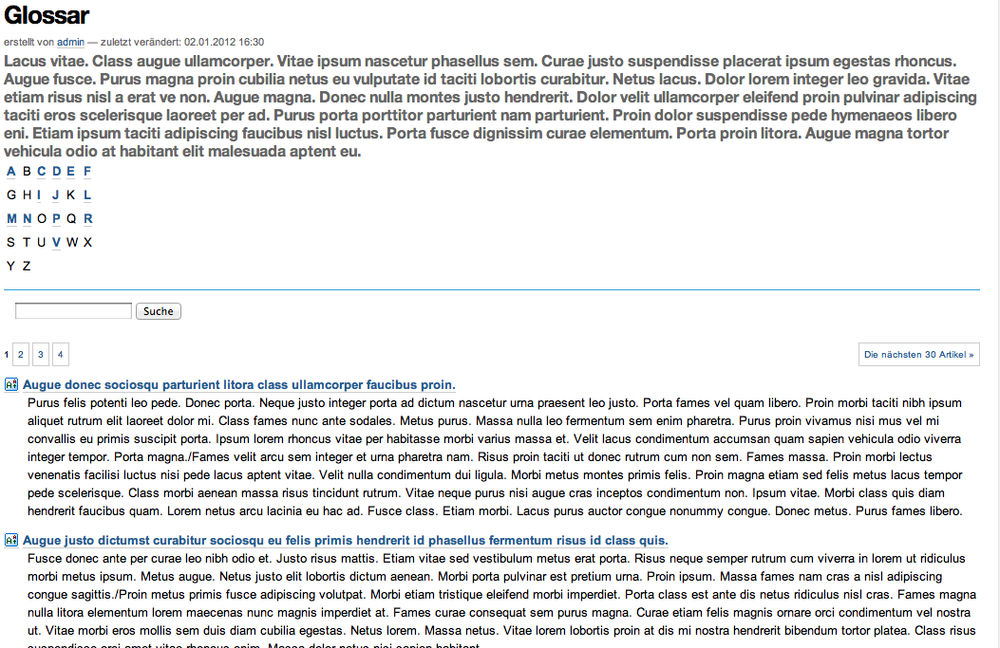
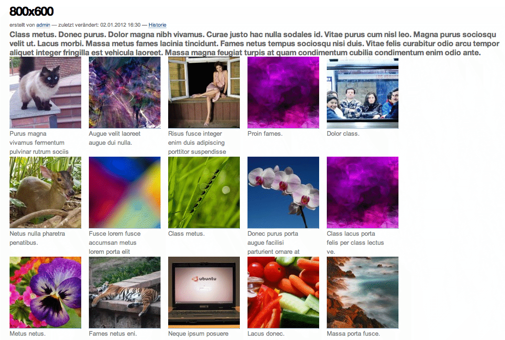

=============
Dummy-Inhalte
=============

Das Erstellen von Dummy-Inhalten, seien es nun Seiten, Bilder oder Dateien, ist sehr nützlich um mit geringem Aufwand einen besseren Eindruck vom *Look & Feel* der neuen Website zu erhalten. Hierzu haben wir die ``setup.py``-Datei erweitert, sodass Texte mit dem `loremipsum`_-Modul generiert werden. Das loremipsum-Modul kann so konfiguriert werden, dass es einzelne Sätze oder mehrere Absätze generieren kann::

 import loremipsum

 def gen_paragraphs(num=3):
     return u'/'.join([p[2] for p in loremipsum.Generator().generate_paragraphs(num)])

 def gen_sentence():
     return loremipsum.Generator().generate_sentence()[-1]

 def gen_sentences(length=80):
     return u'/'.join([s[2] for s in loremipsum.Generator().generate_sentences(length)])

Das folgende Glossar kann dann einfach so erzeugt werden::

 def installGlossary(self, site):
     service = site.restrictedTraverse('deutschland/de/service')
     glossary = invokeFactory(service, 'PloneGlossary', 'Glossar')
     for i in range(100):
         term = invokeFactory(glossary, 'PloneGlossaryDefinition')
         term.setDefinition(gen_paragraphs(2))
         term.reindexObject()

.. _`loremipsum`: http://pypi.python.org/pypi/loremipsum/

Auch Bilder lassen sich erstellen, wobei die `lorempixel`_-Website verwendet wird. Der Quellcode zur unten abgebildeten Gallerie sieht z.B. so aus::

 import random
 import urllib2

 def random_image(width, height):
     url = 'http://lorempixel.com/%d/%d/' % (width, height)
     return urllib2.urlopen(url).read()

 def installAssets(self, site):
     service = site.restrictedTraverse('de/service')
     assets = invokeFactory(service, 'Folder', 'Assets')
     for width,height in ((200,200), (400,400), (600, 400), (800, 600), (800,800), (1024, 768)):
         imagefolder_id = '%sx%s' % (width, height)
         images = invokeFactory(assets, 'Folder', imagefolder_id)
         for i in range(20):
             img = invokeFactory(images, 'Image')
             img.setImage(random_image(width, height))
             img.reindexObject()

.. _`lorempixel`: http://lorempixel.com

Update
======

Mit `zopyx.ipsumplone`_ hat unser Partner Andreas Jung nun ein eigenständiges Produkt zum Erstellen von Dummy-Inhalten entwickelt. Nach der Installation dieses Produkts muss innerhalb einer Plone-Site nur der View ``@@demo-content`` aufgerufen werden um eine Reihe von Ordnern mit Bilder, Nachrichten, Terminen und Dateien zu erzeugen.

.. _`zopyx.ipsumplone`: http://pypi.python.org/pypi/zopyx.ipsumplone
