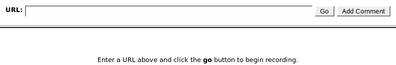
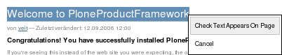

====================================================
Aufzeichnen funktionaler Tests mit zope.testrecorder
====================================================

Der Zope-Testrecorder zeichnet funktionale Tests im Browser auf und speichert sie als ausführbare Tests. Funktionale Tests, die den Zope-Testbrowser nutzen, ersparen uns das erneute Herumklicken im Browser zum Testen des User Interfaces. Der Zope-Testrecorder kann auch `Selenium`_-Tests, eine andere Form von funktionalen Tests, die in Ihrem Webbrowser direkt vor Ihren Augen ablaufen und daher auch JavaScript unterstützen.

Download und Installation
=========================

Hierzu müssen Sie ``zope.testrecorder`` nur in der ``buildout.cfg``-Datei eintragen::

 [buildout]
 ...
 eggs =
     ...
     zope.testrecorder
 ...

 [instance]
 ...
 zcml =
      ...
      zope.testrecorder

Anschließend wird das Buildout-Skript aufgerufen und die Instanz neu gesteartet.

Testrecorder zum Aufzeichnen funktionaler Tests
===============================================

#. Nun sollte der ``zope.testrecorder`` verfügbar sein unter folgender URL::

    http://localhost:8080/++resource++recorder/index.html

   Sie sollten nun folgende Seite sehen können:

   |testrecorder Start|

#. Geben Sie nun die Adresse Ihrer Plone-Site ein, z.B. ``http://localhost:8080/mysite``, und klicken auf *Go*.
#. Wollen Sie freien Text in Ihr DocTest-Dokument schreiben, klicken Sie auf die *Add comment*-Taste.
#. Wenn Sie überprüfen wollen, ob bestimmter Text auf Ihrer Seite erscheint, markieren Sie diesen Text, klicken dann bei gedrückter Umschalt-Taste auf diesen Text und wählen *Check text appears on page*.

   |testrecorder Popup zum Überprüfen von Text|

#. Schließlich können Sie die Aufzeichnung beenden und sie als Python DocTest abspeichern. Dann erhalten Sie ungefähr dies::

    Create the browser object we'll be using.

        >>> from zope.testbrowser import Browser
        >>> browser = Browser()
        >>> browser.open('http://localhost:8080/mysite')

    A test comment.

        >>> 'start writing' in browser.contents
        True

#. Anschließend können Sie diesen Text in eine DocTest-Datei schreiben und gegebenenfalls Änderungen vornehmen.
#. Lesen Sie ``INSTALL.txt`` für weitere Anweisungen.

Tipps für den Zope-Testrecorder
===============================

Testplan
 Sie sollten ein Skript erstellen bevor Sie mit dem Aufzeichnen von Tests beginnen. Kommentieren Sie Ihre Tests um festzuhalten, was getestet werden soll.
Bedenken Sie, welchen Link Sie ausführen
 Überlegen Sie sich, welche Aktionen die allgemeingültigsten und zuverlässigsten Tests bieten.
Setzen Sie die Site vorher auf
 Wie beim Zope-Testbrowser, sollte auch beim Zope-Testrecorder zunächst eine Site aufgesetzt werden, bevor Sie mit dem Aufzeichnen der Tests beginnen.
Räumen Sie Ihren DocTest auf
 Bevor Sie das Schreiben von DocTests mit dem Zope-Testrecorder beenden, sollten Sie den Kode noch von Textstellen befreien, deren Konsistenz nicht gewährleistet werden kann, wie z.B.

 - aus dem Datum generierte IDs von Inhaltstypen
 - und identische oder nahezu identische Textstellen, die in Ihrem DocTest erscheinen.

.. _`Selenium`: http://www.zope.org/Members/tseaver/Zelenium
