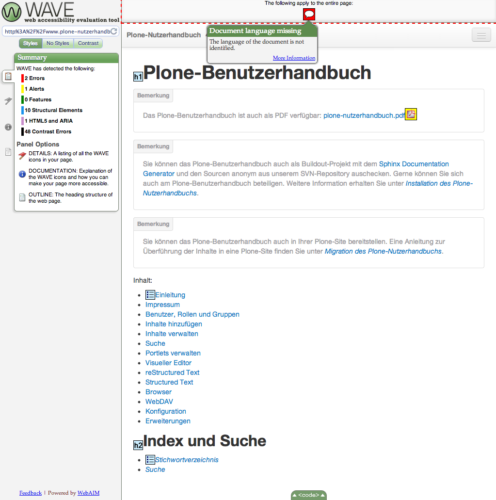
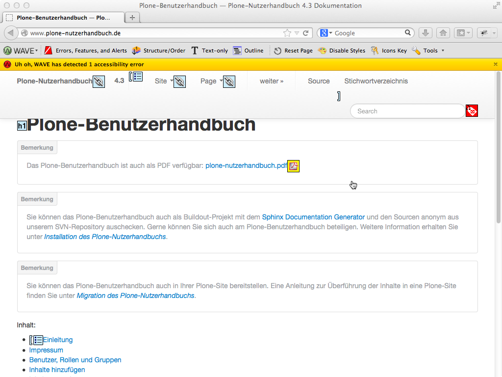

======================
iAccessibility-Analyse
======================

`WAVE <http://wave.webaim.org/>`_ ist ein Werkzeug zum Analysieren der Barrierefreiheit:

|WAVE|

Die `WAVE Toolbar <http://wave.webaim.org/toolbar/>`_ ist eine Offline-Version
dieses Dienstes als Firefox-Plugin:

|WAVE Toolbar|

WAVELibrary
===========

`robotframework-wavelibrary
<http://pypi.python.org/pypi/robotframework-wavelibrary>`_ ist eine Bibliothek
für das Robot-Framework, die die WAVE-Analyse Robot-Framework-Test durchführt.

Installation
------------

In die Buildout-Konfiguration wird der Abschnitt ``pybot`` mit dem Python-Egg
``robotframework-wavelibrary`` hinzugefügt::

 [buildout]
 parts =
     ...
     pybot

 [pybot]
 recipe = zc.recipe.egg
 eggs =
      robotframework
      robotframework-wavelibrary

Anschließend wird die Bibliothek installiert mit::

 $ python bootstrap.py
 $ ./bin/buildout

Accessibility-Tests
-------------------

Hierfür können wir z.B. eine Datei ``plone.robot`` mit folgendem Inhalt
schreiben::

 *** Settings ***

 Library  WAVELibrary

 Resource  plone/app/robotframework/server.robot

 Suite Setup  Setup
 Suite Teardown  Teardown

 *** Variables ***

 ${START_URL}  about:

 *** Keywords ***

  Setup
      Setup Plone site  plone.app.robotframework.testing.AUTOLOGIN_ROBOT_TESTING
      Import library  Remote  ${PLONE_URL}/RobotRemote
      Enable autologin as  Site Administrator
      Set autologin username  test-user-1

  Teardown
      Teardown Plone Site

  *** Test Cases ***

  Test new page form tabs
      [Template]  Check new page tabs for accessibility errors
      default
      categorization
      dates
      creators
      settings

  *** Keywords ***

  Check new page tabs for accessibility errors
      [Arguments]  ${fieldset}
      Go to  ${PLONE_URL}/createObject?type_name=Document
      ${location} =  Get location
      Go to  ${PLONE_URL}
      Go to  ${location}#fieldsetlegend-${fieldset}
      Check accessibility errors

Eine vollständige Liste der WAVE-Library-Keywords erhalten Sie unter `Keywords
<http://robot-framework-wave-library.readthedocs.org/en/latest/#keywords>`_.
Daneben können auch weiterhin die  `robot-Keywords
<http://robotframework.googlecode.com/hg/doc/libraries/BuiltIn.html?r=2.7.7>`_ und die `Selenium-Leywords
<http://rtomac.github.com/robotframework-selenium2library/doc/Selenium2Library.html>`_ verwendet werden.

Dieser Test kann nun aufgerufen werden mit::

 $ ./bin/pybot plone.robot

.. seealso::
    - `Stay accessible: Robot Framework library for WAVE Toolbar
      <http://datakurre.pandala.org/2013/05/stay-accessible-robot-framework-library.html>`_
