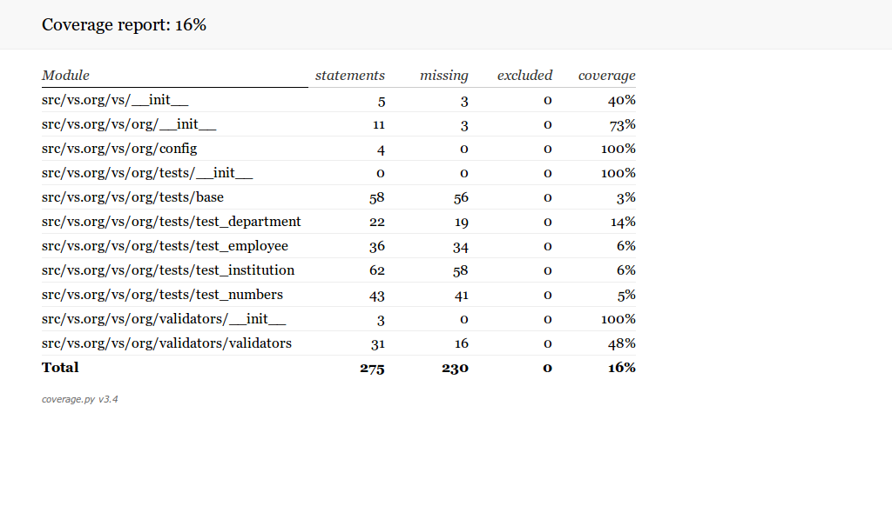
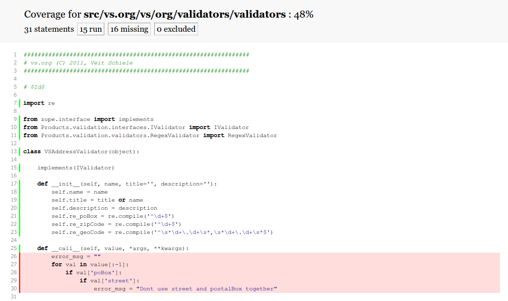

=============================
Testabdeckung (Code Coverage)
=============================

Der Zope Test Runner ermöglicht auch, die Testabdeckung eines Produkts zu ermitteln::

  ./bin/test -s vs.registration --coverage=coverage

Für eine schnelle Statusübersicht erhalten Sie folgendes Ergebnis::

   Ran 19 tests with 0 failures and 0 errors in 43.924 seconds.
 Tearing down left over layers:
   Tear down Products.PloneTestCase.layer.PloneSite in 2.009 seconds.
   Tear down Products.PloneTestCase.layer.ZCML in 0.012 seconds.
 lines   cov%   module   (path)
    14    57%   vs.registration.__init__   (/home/veit/myproject/src/vs.registration/vs/registration/__init__.py)
    66    63%   vs.registration.browser.enquiry   (/home/veit/myproject/src/vs.registration/vs/registration/browser/enquiry.py)
     7   100%   vs.registration.browser.registrant   (/home/veit/myproject/src/vs.registration/vs/registration/browser/registrant.py)
    26    76%   vs.registration.browser.registration   (/home/veit/myproject/src/vs.registration/vs/registration/browser/registration.py)
    37   100%   vs.registration.content.registrant   (/home/veit/myproject/src/vs.registration/vs/registration/content/registrant.py)
    44   100%   vs.registration.content.registration   (/home/veit/myproject/src/vs.registration/vs/registration/content/registration.py)
    22   100%   vs.registration.interfaces   (/home/veit/myproject/src/vs.registration/vs/registration/interfaces.py)
    64   100%   vs.registration.portlets.registrants   (/home/veit/myproject/src/vs.registration/vs/registration/portlets/registrants.py)
    25    96%   vs.registration.setuphandlers   (/home/veit/myproject/src/vs.registration/vs/registration/setuphandlers.py)
    17   100%   vs.registration.tests.base   (/home/veit/myproject/src/vs.registration/vs/registration/tests/base.py)
    12    91%   vs.registration.tests.test_doctest   (/home/veit/myproject/src/vs.registration/vs/registration/tests/test_doctest.py)
    74   100%   vs.registration.tests.test_portlet_registrants   (/home/veit/myproject/src/vs.registration/vs/registration/tests/test_portlet_registrants.py)
    22   100%   vs.registration.tests.test_setup   (/home/veit/myproject/src/vs.registration/vs/registration/tests/test_setup.py)

Ausführlichere Informationen für jede Testdatei sind im Verzeichnis ``coverage`` enthalten, z.B. für ``vs.registration.browser.registration`` in ``coverage/vs.registration.browser.registration.cover``::

        """Define a browser view for the Registration content type. In the FTI
        configured in profiles/default/types/*.xml, this is being set as the default
        view of that content type.
     1: """

     1: from Acquisition import aq_inner
     1: from Products.Five.browser import BrowserView
     1: from Products.Five.browser.pagetemplatefile import ViewPageTemplateFile

     1: from Products.CMFCore.utils import getToolByName

     1: from vs.registration.interfaces import IRegistration
     1: from vs.registration.interfaces import IRegistrant

     1: from plone.memoize.instance import memoize

     2: class RegistrationView(BrowserView):
            """Default view of a registration
            """

            # This template will be used to render the view. An implicit variable
            # 'view' will be available in this template, referring to an instance
            # of this class. The variable 'context' will refer to the registration
            # being rendered.

     1:     __call__ = ViewPageTemplateFile('registration.pt')

     1:     @memoize
             def registrations(self):
 >>>>>>         context = aq_inner(self.context)
 >>>>>>         catalog = getToolByName(context, 'portal_catalog')
 >>>>>>         return [ dict(url=registration.getURL(),
                              title=registration.Title,
                              description=registration.Description,)
                         for registration in
                            catalog(object_provides=IRegistration.__identifier__,
 >>>>>>                             path=dict(query='/'.join(context.getPhysicalPath()),
 >>>>>>                                       depth=1),
 >>>>>>                             sort_on='sortable_title')
                       ]

 ...

Dies entspricht exakt der Datei, jedoch ist den meisten Zeilen eine Zahl vorangestellt:

``n``
 diese Zeile wurde ``n``-mal aufgerufen.
``>>>>>>``
 diese Zeile wurde nicht aufgerufen.

Die Anzahl der durch den Test nicht aufgerufenen Zeilen durch die gesamte Anzahl der Zeilen ergibt die Testabdeckung in Prozent.

Testabdeckung für mehrere Eggs
==============================

Auch für mehrere Eggs lässt sich die Testabdeckung mit ``zc.recipe.testrunner`` angeben::

 [buildout]
 ...
 parts =
     ...
     test
     coverage

 [test]
 recipe = zc.recipe.testrunner
 eggs =
     ${instance:eggs}

 [coverage]
 recipe = zc.recipe.egg
 eggs = coverage
 initialization =
     include = '--source=${buildout:directory}/src'
     sys.argv = sys.argv[:] + ['run', include, 'bin/test', '--all']

Report erstellen
================

``coverage`` erstellt einen übersichtlichen Report über die Testabdeckung. Um einen solchen Report zu erhalten, kann einfach ein entsprechender Abschnitt in der  ``buildout.cfg``-Datei eingetragen werden::

 [buildout]
 ...
 parts =
     ...
     report
 ...
 [report]
 recipe = zc.recipe.egg
 eggs = coverage
 scripts = coverage=report
 initialization =
     sys.argv = sys.argv[:] + ['html', '-i']

Anschließend können Sie ``file:///home/veit/vs_buildout/htmlcov/index.html`` in Ihrem Browser öffnen und erhalten einen übersichtlichen Report:

