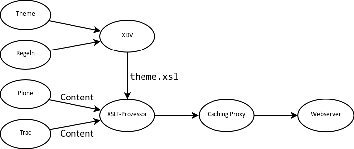

==============
collective.xdv
==============

Einführung
==========

``collective.xdv`` ist ein neuer Ansatz um eine Plone-Website zu gestalten Einige Vorteile von ``collective.xdv`` sind:

- Web-Designer müssen kein Vorwissen in bezug auf Plone und Python mitbringen;
- Standardbibliotheken und -werkzeuge können verwendet werden;
- Auch eine bereits existierende Webgestaltung, z.B. von `Open Source Web Design`_, kann einfach verwendet werden.

Im Vergleich zu :doc:`../deliverance/index` weist ``collective.xdv`` folgende Unterschiede auf:

- Es wird nur das XSLT-Subset von Deliverance verwendet.
- Die Antwortzeiten von XDV sind schneller, da nicht erst zur Laufzeit eine XSLT-Datei kompiliert wird.
- Es gibt nur XPath- und CSS3-Selektoren:

  +----------------------------------------+--------------------------------+
  | XDV                                    | Deliverance                    |
  +========================================+================================+
  | ``replace``                            | ``replace``                    |
  +----------------------------------------+--------------------------------+
  | ``copy``                               | ``replace`` + Kindselektortyp  |
  +----------------------------------------+--------------------------------+
  | ``before``                             | ``prepend``                    |
  +----------------------------------------+--------------------------------+
  | ``after``                              | ``append``                     |
  +----------------------------------------+--------------------------------+
  | ``prepend``                            | ``prepend`` + Kindselektortyp  |
  +----------------------------------------+--------------------------------+
  | ``prepend`` + XPATH + ``@id``          | ``prepend`` + Kindselektortyp  |
  |                                        |                                |
  | oder                                   |                                |
  |                                        |                                |
  | ``prepend`` + XPATH + ``@class``       |                                |
  +----------------------------------------+--------------------------------+
  | ``append``                             | ``append`` + Kindselektortyp   |
  +----------------------------------------+--------------------------------+
  | ``drop``                               | ``drop``                       |
  +----------------------------------------+--------------------------------+

Bedingte Regeln
===============

- Es lassen sich Bedingungen für die Aktionen angeben,  z.B.::

   <drop if-content="not(//*[@class='portlet'])" css:theme="#portlet-wrapper" />

- Darüber hinaus kann eine Bedingung auch auf mehrere Aktionen angewendet werden, z.B.::

   <rules css:if-content="#personal-bar">
       <append css:theme="#header-box" css:content="#user-prefs"/>
       <append css:theme="#header-box" css:content="#logout"/>
   </rules>

  Und auch verschachtelte Bedingungen sind mögich, z.B.::

   <rules if-content="condition1">
       <rules if-content="condition2">
           <copy if-content="condition3" css:theme="#a" css:content="#b"/>
       </rules>
   </rules>

  oder::

   <copy if-content="(condition1) and (condition2) and (condition3)" css:theme="#a" css:content="#b"/>

- Auch mehrere ``Themes`` lassen sich durch Bedingungen unterscheiden, z.B.::

   <theme href="theme.html"/>
   <theme href="news.html" css:if-content="body.section-news"/>
   <theme href="members.html" css:if-content="body.section-members"/>

  oder::

   <rules css:if-content="body.section-news">
       <theme href="news.html"/>
       <copy css:content="h2.articleheading" css:theme="h1"/>
   </rules>

- Es können auch Pfadbedingungen angegeben werden, z.B.::

   <theme href="news.html" if-path="/news"/>

  Endet die Pfadbedingung mit ``/``, so wird die Regel nur angewendet, wenn die URL an dieser Stelle endet, also z.B.::

   <theme href="news.html" if-path="/news/"/>

  wird auf ``/Plone/news`` oder ``/Plone/news/`` angewendet, nicht jedoch auf ``/Plone/news/news1.html``.

- Auch externe Inhalte können eingebunden werden, z.B. in einem Mashup::

   <append css:content="#timeline"
           href="/http://twitter.com/plone"
           css:theme="#rightbar" />

Reihenfolge
===========

Die Regeln werden nicht nacheinander abgearbeitet sondern in folgender festgelegter Reihenfolge:

#. ``<before />``
#. ``<drop />``
#. ``<replace />``
#. ``<prepend />``
#. ``<after />``

Dies führt meines Erachtens zu einer unnötigen Komplexität bei der Analyse, welche Regeln in welcher Reihenfolge abgearbeitet werden. Zudem bringt XDV keine Debug-Konsole mit, wodurch diese Analyse deutlich erschwert wird.

.. _`Open Source Web Design`: http://www.oswd.org/

.. toctree::
    :titlesonly:
    :maxdepth: 1
    :hidden:

    installation
    theme-transformation
    transformationsregeln
    xdvtheme-produkt
