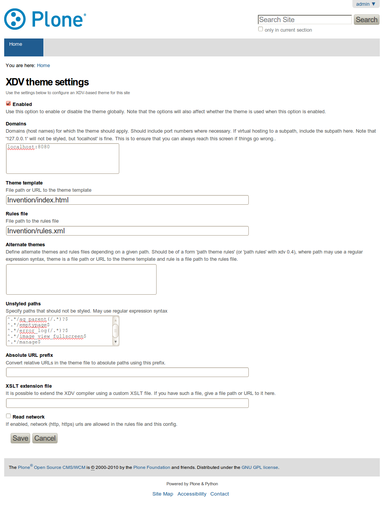
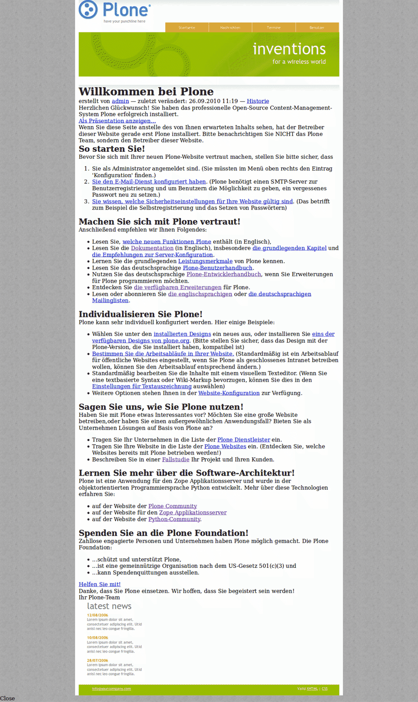

====================
Theme-Transformation
====================

Erstellen eines Themes
======================

Wir können nun unser neues *Theme* erstellen indem wir in unserem Buildout-Projekt einen Ordner ``static`` erstellen und in diesem das `Invention`_-Theme von Open Source Web Design bereitstellen::

 $ cd collective-xdv_buildout
 $ curl -O http://www.oswd.org/files/designs/3293/Invention.zip
 $ unzip Invention.zip

Nun erstellen wir in unserem ``Invention``-Ordner noch die :download:`rules.xml`-Datei mit den Angaben für die XSLT-Transformationen.

Aktivieren und Konfigurieren von ``collective.xdv``
===================================================

Setzen Sie nun eine neue Plone-Site mit dem *Extension*-Profile ``XDV theme support`` auf und wählen anschließend in deren *Plone Control Panel* die Konfiguration für das *XDV theme*-Zusatzprodukt aus:

``Enabled``
 ändert die XDV-Theme-Transformation.

 Aktivieren Sie diese Option.

``Domains``
 Auf welche Domäne soll die Transformation angewendet werden?

 Dabei ist zu berücksichtigen, dass auf ``127.0.0.1`` aus Sicherheitsgründen nie eine Theme-Transformation angewendet werden kann, sodass Sie immer wieder zu Ihrer Site zurückkehren können auch wenn die Transformationsregeln unbrauchbar werden sollten. Dieses Verhalten kann auch dazu genutzt werden, die CSS3-Selektoren und XPath-Anweisungen für ``content`` auszulesen.

 Der Standardwert ist ``localhost:8080``

``Theme template``
 Der Pfad zu einer statischen HTML-Datei. Eine relative Pfadangabe ist immer relativ zum Buildout-Verzeichnis, also z.B.::

  Invention/index.html

 Neben Pfadangaben im Dateisystem lassen sich hier auch Python-Pfade angeben, z.B.::

  python://vs.xdvtheme/static/index.html

``Rules file``
 Der Pfad zu einer XML-Datei, die die Regeln für die Transformation enthält, also z.B.::

  Invention/rules.xml

 Auch hier lassen sich wieder Python-Pfade angeben, z.B.::

  python://vs.xdvtheme/static/rules.xml

Häufig sind an dieser Stelle keine weiteren Angaben zu machen. Daher speichern wir die Einträge ab und sollten anschließend unsere einfachen XSLT-Transformationen betrachten können:

Im folgenden noch kurz die weiteren Optionen für die *XDV theme*-Konfiguration:

``Alternate themes``
 Hier können alternative ``themes``- und ``rules``-Dateien angegeben werden. Die Angabe erfolgt in der Form ``path|theme|rules``.

 ``path``
  Regulärer Ausdruck
 ``theme``
  Dateipfad oder URL
 ``path``
  Pfad zu der Datei, die die XDV-Transformationsregeln bereitstellt.

``Unstyled paths``
 Pfade, die nicht gestaltet werden sollen wobei die Pfadangaben aus regulären Ausdrücken bestehen sollen, z.B.::

 ^.*/manage$

``Absolute URL prefix``
 konvertiert relative URLs in der ``theme``-Datei zu absouten Pfaden unter Verwendung dieses Präfixes.
``XSLT extension file``
 XDV kann erweitert werden um eine eigene XSLT-Datei. Diese kann hier als Pfadangabe oder URL angegeben werden.
``Read network``
 Ist diese Option aktiviert, können URLs für die Angabe der ``rules``- und ``config``-Dateien angegeben werden.

.. _`Invention`: http://www.oswd.org/design/information/id/3293
