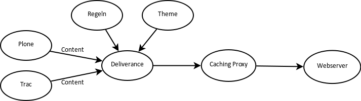

===========
Deliverance
===========

Deliverance wird zur Gestaltung von HTML verwendet wobei ein konsistenter Stil auf verschiedene Anwendungen und statische Dateien angewendet werden kann.

Einführung
==========

Mit `Deliverance`_ kann eine Plone-Site ähnlich wie mit
:doc:`../collective.xdv/index` über XSLT-Regeln gestaltet werden.  Daher teilt
``Deliverance`` mit ``collective.xdv`` folgende Vorteile:

.. _`Deliverance`: http://packages.python.org/Deliverance/

- Web-Designer müssen kein Vorwissen in Bezug auf Plone und Python mitbringen;
- Standardbibliotheken und -werkzeuge können verwendet werden;
- Auch eine bereits existierende Webgestaltung, z.B. von `Open Source Web Design`_, kann einfach verwendet werden.

.. _`Open Source Web Design`: http://www.oswd.org/

``Deliverance`` bietet darüberhinaus noch folgende Vorteile:

- Die Transformationsregeln lassen sich an Bedingungen knüpfen und gehen damit über XSLT hinaus.
- ``Deliverance`` ist **nicht** Plone-spezifisch, sodass das Theme auch für weitere Webanwendungen wie Trac, Mailman, Wordpress etc. genutzt werden kann.
- Mit ``Deliverance`` lassen sich einfach Mashups verschiedener Webinhalte darstellen.

.. toctree::
    :titlesonly:
    :maxdepth: 0
    :hidden:

    installation
    serverkonfiguration
    transformationsregeln
