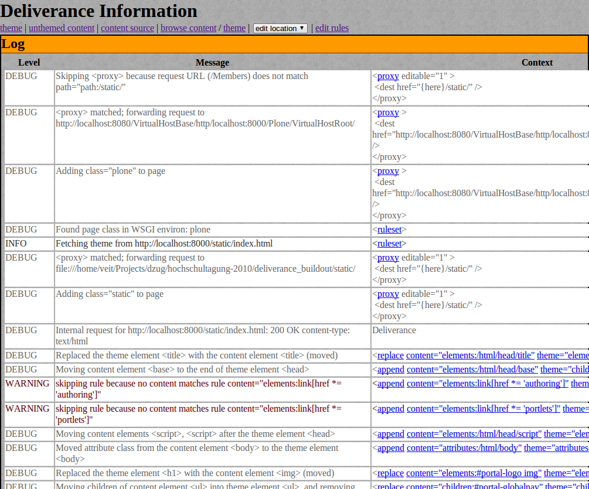

====================
Server-Konfiguration
====================

Nun definieren wir in ``rules.xml`` die Konfiguration für den Deliverance-Server::

 <server-settings>
     <server>localhost:8000</server>
     <execute-pyref>true</execute-pyref>
     <dev-allow>localhost</dev-allow>
     <dev-user username="admin" password="secret" />
 </server-settings>

``<server>``
    gibt den verwendeten Host und Port an.

    Wird ``localhost`` oder ``127.0.0.1`` angegeben, sind nur lokale Verbindungen zulässig.

    Der Standardwert ist ``localhost:8080``

``<execute-pyref>``
    Hiermit können diejenigen, die Transformationsregeln schreiben dürfen, mit jeder Anfrage beliebigen Code ausgeführen.

    Der Standardwert ist ``true``.

    Für weitere Informationen schauen Sie in die ``pyref``-Python-Referenz

``<dev-allow>``
    Liste der IP-Adressen, die Zugang erhalten.
``<dev-user>``
    Die Angabe von Nutzername und Passwort ist nur sinnvoll, wenn ``<dev-allow>`` sehr resktrikiv gehandhabt wird.

Weitere Informationen zur Server-Konfiguration erhalten Sie in `server-settings`_.

.. _`server-settings`: http://packages.python.org/Deliverance/configuration.html#server-settings

Proxy-Konfiguration
===================

In derselben Datei werden auch die Pfade für den Proxy-Server angegeben::

 <proxy path="/static" class="static" editable="1">
     <dest href="{here}/static/" />
 </proxy>

 <proxy path="/" class="plone">
     <dest href="http://localhost:8080/VirtualHostBase/http/localhost:8000/Plone/VirtualHostRoot/" />
 </proxy>

``<proxy path>``
     Dies liefert bei einer Anfrage an ``/static`` die Dateien aus ``{here}/static`` aus, wobei ``{here}`` dasselbe Verzeichnis ist, in dem auch die ``rules.xml``-Datei liegt.
``<dest>``
    gibt das Ziel der Anfrage an.

    Es kann sowohl als href-URL (``http://…``) als auch als Datei-URL (``file:///…``) angegeben werden.

Starten des Servers
===================

Sie können nun den Server starten mit::

 $ ./bin/deliverance-proxy rules.xml

Soll die Ausgabe nicht im Terminal ausgegeben werden, kann der Deliverance-Proxy gestartet werden mit::

 $ /usr/bin/nohup ./bin/deliverance-proxy rules.xml &

Anschließend können Sie sich unter ``http://localhost:8000/.deliverance/login`` anmelden und nun jeder URL ``?deliv_log`` anhängen um das Deliverance-Log am unteren Rand der Seite zu erhalten. Das Log beschreibt detailliert, wie die Seite transformiert wurde einschließlich der Informationen über den Proxy und jede Anfrage. Zudem können Sie sich den Quellcode anschauen, die Regeln bearbeiten etc. Diese Angaben erleichtern das Schreiben der Transformationsregeln ungemein.

Deliverance hinter Apache
=========================

Damit das ``static``-Verzeichnis nicht über die Deliverance-Port-Nummer ausgeliefert wird, genügt es nicht, eine entsprechende Apache ``RewriteRule`` zu schreiben. Der Apache muss darüberhinaus konfiguriert werden mit ``ProxyPreserveHost On``. Dies sendet den Host-Namen, den der Apache vom Client erhält, an Deliverance weiter. Und sobald der Deliverance-Proxy den Host-Namen erhalten hat, verhält er sich wie gewünscht.
