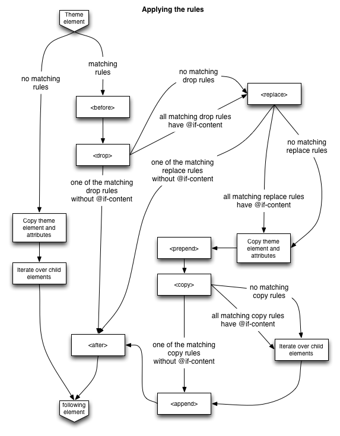

============
Diazo-Regeln
============

``<theme />``
 spezifiziert eine ``theme``-Datei, z.B.::

  <theme href="theme/theme.html" />

 ``href``
  erforderlicher Verweis auf eine HTML-Datei als relative oder absolute URL
 ``if``
  spezifiziert eine mögliche Bedingung für diesen Verweis. Dies ermöglicht auch die Verwendung mehrerer Themes
 ``if-path``
  spezifiziert einen URL-Pfad, der mit dem aktuellen Request erfüllt sein muss damit die Regel angewendet wird.

``<notheme />``
 unterdrückt das Theming, z.B.::

  <theme href="theme/theme.html" />
  <notheme css:if-content="body.template-file_view" />

 Es können auch mehrere ``<notheme />``-Elemente angegeben werden.

 Es stehen die Attribute  ``if``,  ``if-path``, ``if-content`` und ``css:if-content`` zur Verfügung.

``<replace>``
 ersetzt ein Element des Theme durch den Inhalt der Site.

 Eine übliche Anwendung ist z.B., die ``<title>`` und ``<base>``-Tags aus Plone zu übernehmen::

  <replace theme="/html/head/title" content="/html/head/title" />
  <replace theme="/html/head/base" content="/html/head/base" />

``<append>``, ``<prepend>``
 fügt Inhalte der Website am Anfang oder Ende des angegebenen Elements ein.

 Hiermit können z.B. die von Plone verwalteten CSS- und Javascript-Dateien dem Theme hinzugefügt werden::

  <append theme='/html/head' content='/html/head/script' />
  <append theme="/html/head" content="/html/head/link | /html/head/style" />

 Eine weitere, häufig verwendete Möglichkeit ist die Verwendung der ``id``- und ``class``-Elemente des ``body``-Tags um verschiedene Bereiche der Website unterschiedlich zu gestalten::

  <prepend theme="/html/body" content="/html/body/@class" />

 An dem folgenden Beispiel, in dem die linke und rechte Spalte von Plone in einer Spalte zusammengefasst werden soll, wird deutlich, dass mit der Verwendung von <append> und <prepend> verhindert werden kann, dass eine Regel die Inhalte einer anderen Regel überschreibt::

  <append content='//*[@id="portal-column-one"]/div' theme='//*[@id="rightbar"]' />
  <append content='//*[@id="portal-column-two"]/div' theme='//*[@id="rightbar"]' />

``<before>``, ``<after>``
 Diese sind äquivalent zu ``<append />`` und ``<prepend />``, aber stellen den betreffenden Inhalt vor oder nach dem betreffenden Element des theme dar.
``<copy>``
 kopiert HTML-Knoten aus der Plone-Site innerhalb des Theme-Tags::

  <copy content='//*[@id="portal-globalnav"]/li' theme='//*[@id="main-nav"]' />

 Beachten Sie hierbei, dass jedes ``<li>``-Element innerhalb von ``id="portal-globalnav"`` der Plone-Site in den Knoten mit der ``id="main-nav"`` des Themes kopiert wird.

``<drop>``
 entfernt das angegebene Element.

 Diese Regel unterscheidet sich insofern von den anderen, da sie aus nur einem ``content-value``-Paar besteht.

 Hiermit kann die Ausgabe von Inhalten der Plone-Site unterbunden werden, z.B.das Icon des user-name-Knotens::

  <drop content='//*[@id="user-name"]/img' />

 Genaugenommen wird jedes ````-Tag innerhalb des Elements mit der ID ``user-name`` entfernt.

``<strip>``
 entfernt das angegebene Element aus ``theme`` oder ``content`` wobei die Kindelemente erhalten bleiben.

 **Beispiele**::

  <strip css:theme="#content" />

 Das Element mit der ID ``content`` wird entfernt nicht jedoch dessen Kindelemente::

  <strip css:content="#main-area .wrapper" />
  <replace css:theme="#content-area" css:content="#main-area" />

 Zunächst wird das Element in ``theme`` mit der ID ``content-area`` durch das Element in ``content`` mit der ID ``main-area`` ersetzt und dann werden alle Kindelemente von ``#main-area`` mit der Klasse ``wrapper`` abgezogen.

``<merge>``
 fügt die Werte von Elementen aus ``theme`` und ``content`` desselben Attributs zusammen, also z.B.::

  <merge attributes="class" css:theme="body" css:content="body" />

Reihenfolge
===========

Die Regeln werden nicht nacheinander abgearbeitet sondern in folgender festgelegter Reihenfolge:

#. ``<before />``-Regeln, die ``theme`` verwenden, nicht jedoch ``theme-children``.
#. ``<drop />``
#. ``<replace />``-Regeln, die ``theme`` verwenden, nicht jedoch ``theme-children``.

   Soll ``<drop />`` auf demselben Knoten verwendet werden, muss ``method="raw"`` verwendet werden, also z.B.::

    <drop css:content="#viewlet-social-like"/>
    <replace method="raw"
        css:theme-children="#viewlet-social-like"
        css:content="#viewlet-social-like"
        />

#. ``<strip />``
#. Regeln mit ``attributes``, also z.B.::

    <merge attributes="class" css:theme="body" css:content="body" />

#. ``theme-children`` von ``<before />``-, ``<replace />``- und ``<after />``-Regeln sofern keine ``<replace />``-Regel für ``theme`` für denselben Knoten bereits früher ausgeführt wurde.
#. ``<after />``-Regeln, die ``theme`` verwenden, nicht jedoch ``theme-children``.

Die folgende Grafik veranschaulicht die Reihenfolge, in der die Regeln angewendet werden:



Diese festgelegte Reihenfolge führt meines Erachtens zu einer unnötigen Komplexität bei der Analyse, welche Regeln in welcher Reihenfolge abgearbeitet werden. Zudem bringt Diazo zum aktuellen Zeitpunkt noch keinen Debugger mit, wodurch die Analyse zusätzlich erschwert wird.

Keine Übereinstimmung
=====================

- Falls keine Regel auf ein bestimmtes Element des ``theme`` zutrifft, so wird dieses Element ignoriert.
- Eine ``<replace>``-Regel, die auf ein Element in ``theme``, jedoch nicht auf ein Element in ``content`` zutrifft, wird im ``theme`` entfernt.
- Eine ``<copy>``-Regel, die auf ein bestimmtes Element des ``theme`` zutrifft, entfernt ebenfalls dieses Element wenn es kein entsprechendes Element in ``content`` gibt.
- Sollen die Elemente nicht entfernt sondern ein Platzhalter erhalten bleiben, kann eine bedingte Regel mit ``if-content`` angegeben werden, z.B.::

   <replace css:theme="#header" content="#header-element" if-content="" />
