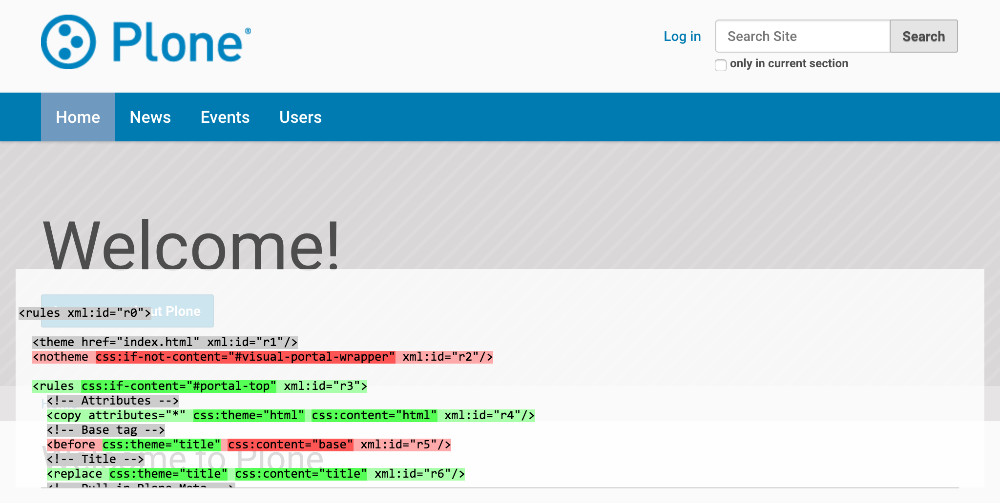

==================
diazotheme-Produkt
==================

Häufig sollen die Resourcen in einem Python-Paket verwaltet werden.

Erstellen und Registrieren des Python-Pakets
============================================

Ein solches Python-Paket lässt sich einfach erstellen mit::

    $ cd src/
    $ paster create -t plone vs.diazotheme
     ...
    Register Profile (Should this package register a GS Profile) [False]: True
    ...

Hiermit erstellen wir das Python Egg ``vs.diazotheme`` aus dem Template ``plone`` mit einem Profil für das *Generic Setup Tool*.

Damit dieses Egg auch der Instanz zur Verfügung steht, ändern Sie Ihre ``buildout.cfg``-Datei folgendermaßen ab::

    [buildout]
    ...
    develop =
        ...
        src/vs.diazotheme
    ...
    [instance]
    ...
    eggs =
        ...
        vs.diazotheme
    zcml =
        ...
        vs.diazotheme

Rufen Sie anschließend Ihr ``./bin/buildout``-Skript erneut auf.

Erstellen Ihres Diazo-Themes
============================

Zunächst wird hierzu in ``vs.diazotheme/vs/diazotheme/configure.zcml`` das Verzeichnis ``Invention`` als Theme registriert::

    <plone:static
        type="theme"
        directory="Invention" />

Erstellen Sie hierin ein eigenes Theme oder laden eins von `Open Source Web Design`_ herunter, z.B. `Invention`_::

    $ cd vs.diazotheme/vs/diazotheme/
    $ curl -O http://www.oswd.org/files/designs/3293/Invention.zip
    $ unzip -v Invention.zip

Anschließend können Sie in diesem Theme die Datei ``manifest.cfg`` erstellen mit Titel, Beschreibung, Verweis auf die ``rules.xml``-Datei etc.::

    [theme]
    title = vs.diazotheme
    description = A diazo theme for veit schiele communications
    rules = /++theme++vs.diazotheme/rules.xml

    [theme:parameters]
    ajax_load = python: 'ajax_load' in request.form

Für die XSLT-Transformationsregeln erstellen Sie anschließend in ``Invention`` die `rules.xml`_-Datei.

Diazo-Konfiguration
===================

Damit Plone die Regeldatei mit den XSLT-Transformationen auch liest, wird ein Profil ``profiles/default/registry.xml`` erstellt, das die Werte im Formular *Diazo theme settings* festlegt::

    <registry>

        <!-- plone.app.theming settings -->
        <record field="enabled" interface="plone.app.theming.interfaces.IThemeSettings">
            <value>True</value>
        </record>
        <record field="rules" interface="plone.app.theming.interfaces.IThemeSettings">
            <value>/++theme++vs.diazotheme/rules.xml</value>
        </record>
        <record field="absolutePrefix" interface="plone.app.theming.interfaces.IThemeSettings">
            <value>/++theme++vs.diazotheme</value>
        </record>
    </registry>

``rules``
    Statt des Verweises auf die ``rules.xml``-Datei in der ``theme``-Ressource mit ``/++theme++vs.diazotheme`` könnte hier auch ein Python-Aufruf stehen:

        python://vs.diazotheme/Invention/rules.xml

``absolutePrefix``
    Auch hier wurde wieder auf die registrierte Theme-Ressource verwiesen::

        /++resource++vs.diazotheme

    Die Angabe konvertiert relative URLs zu absoluten unter Verwendung dieses Präfixes.

CSS-Dateien registrieren
========================

Hierzu erstellen wir die Datei ``profiles/default/cssregistry.xml`` mit folgendem Inhalt::

    <?xml version="1.0"?>
    <object name="portal_css">

        <!-- Set conditions on stylesheets we don't want to pull in -->
        <stylesheet
            expression="not:request/HTTP_X_THEME_ENABLED | nothing"
            id="public.css"
        />

        <!-- Add new stylesheets -->

        <stylesheet title="" authenticated="False" cacheable="True"
            compression="safe" conditionalcomment="" cookable="True" enabled="on"
            expression="request/HTTP_X_THEME_ENABLED | nothing"
            id="++theme++vs.diazotheme/css/style.css" media="" rel="stylesheet"
            rendering="link"
            applyPrefix="True"
        />

    </object>

``not:request/HTTP_X_THEME_ENABLED | nothing``
    sorgt dafür, dass die ``public.css``-Datei nicht ausgeliefert wird wenn
    in der HTML-Anfrage ``HTTP_X_THEME_ENABLED`` enthalten ist, also die
    Plone-Site über Diazo ausgeliefert wird.

    ``request/HTTP_X_THEME_ENABLED | nothing`` würde umgekehrt eine Datei
    nur ausliefern, wenn die Anfrage durch Diazo gestellt wird.

``++theme++vs.diazotheme/styles.css``
    registriert unsere ``styles.css``-Datei an Plones *Stylesheets
    Registry*.
``applyPrefix``
    In Plone 4 kann eine Stylesheetdatei auch mit relativen URLs geparst
    werden.

Schließlich erstellen wir noch die Datei ``profiles/default/metadata.xml`` um mit unserem ``vs.diazotheme``-Produkt auch gleichzeitig das benötigte ``plone.app.theming`` mitzuinstallieren::

    <metadata>
        <version>1</version>
        <dependencies>
            <dependency>profile-plone.app.theming:default</dependency>
        </dependencies>
    </metadata>

Wenn Sie nun das Buildout-Skript erneut aufrufen, anschließend die Instanz starten und eine neue Plone-Site mit dem Profil ``vs.diazotheme`` erstellen, sollte die Plone-Site mit dem neuen Theme erscheinen.

Theme-Debugging
===============

Kompilieren
-----------

Wenn Zope im Entwicklungsmodus gestartet wird, z.B. in der Konsole mit
``./bin/instance fg`` im Vordergrund läuft, wird das Thema bei jeder
Anfrage neu kompiliert. Üblicherweise wird jedoch nur beim ersten Aufruf
kompiliert und anschließend nur noch bei Änderungen im *Control Panel*.
Soll auch in Entwicklungsmodus nicht bei jedem Aufruf neu kompiliert
werden, so sollten Sie die Umgebungsvariable ``DIAZO_ALWAYS_CACHE_RULES``
aktivieren, also z.B. die Instanz starten mit::

    $ DIAZO_ALWAYS_CACHE_RULES=1 ./bin/instance fg

Deaktivieren des Themes
-----------------------

Auch im Entwicklungsmodus ist es möglich, vorübergehend das Thema zu deaktivieren indem Sie den Query String Parameter ``diazo.off=1`` anhängen,
also z.B.::

    http://localhost:8080/mysite/frontpage?diazo.off=1

Overlay
-------

Schließlich können Sie sich in einem Overlay Ihre Diazo-Regeln anzeigen
lassen, wobei *grün* bedeutet, dass die Regel angewendet wird, bei *rot* hingegen die Regel nicht angewendet wird.

Um diese Anscicht zu erhalten, ergänzen Sie die URL im Browser um
``?diazo.debug=1``, also beispielsweise::

    http://localhost:8080/mysite/front-page?diazo.debug=1

Der Parameter wird in Nicht-Entwicklungsmodus ignoriert.

``xsl:message``
---------------

Der Debugger untersucht jede Regel und Zustand isoliert. Wird eine Regel
jedoch durch eine andere Regel außer Kraft gesetzt, zeigt er dies nicht an.
Wird also z.B. wenn eine ``drop``-Regel ein Element entfernt, dem eine
`àppend``-Regel etwas hinzufügen möchte, also z.B.::

    <rules css:if-content="#visual-portal-wrapper xml:id="r0">
        <drop css:theme="content" xml:id="r1"/>
        <append css:theme="content" xml:id="r2">
            <xsl:message>Some content</xsl:message>
        </append>
        ...
    </rules>

Dabei fügt ``<xsl: message>`` nichts in das Dokument selbst ein, sondern
nur in das ``error_log``, das ebenfalls im Overlay angezeigt wird.

.. _`Open Source Web Design`: http://www.oswd.org/
.. _`Invention`: http://www.oswd.org/design/information/id/3293
.. _`rules.xml`: rules.xml/view
.. _`Resourcen registrieren`: http://www.plone-entwicklerhandbuch.de/plone-entwicklerhandbuch/erscheinungsbild/resourcen-registrieren.html
