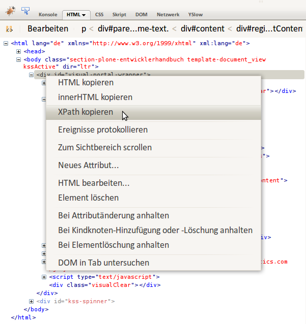

=====================
Transformationsregeln
=====================

XPath
=====

Schauen wir uns nun unsere einfache Transformationsregeln nochmals genauer an::

 <replace theme='//*[@id="leftbar"]' content='//*[@id="content"]' />

Dabei mag Ihnen die Syntax von XPath zur Adressierung der Knoten des DOM zunächst kompliziert erscheinen. Erfreulicherweise gibt es jedoch Werkzeuge wie z.B. `Firebug`_, die Ihnen diese Arbeit abnehmen:

.. _`Firebug`: http://getfirebug.com/



Die aus Firebug kopierten XPath-Angaben können z.B. so aussehen::

 //*[@id="content"]

oder so, falls es sich nicht um eine id handelt sondern einen ``h2``-Tag innerhalb des zweiten ``div``-Tags, der wiedrum von einem ``div``-Tag auf oberster Ebene umgeben ist::

 /html/body/div/div[2]/h2

Neben ``id`` und Anzahl können Knoten auch anhand ihres Namens adressiert werden.

Weitere Informationen erhalten Sie in :term:`XPath`.

Alternativ zu Firebug können Sie auch `CSS to XPath`_ verwenden um sich die XPath-Ausdrücke anzeigen zu lassen.

.. _`CSS to XPath`: http://css2xpath.appspot.com/

Regeln
======

Es gibt lediglich fünf verschiedene Arten von Regeln für die Diazo-Transformationen:

``<replace>``
 ersetzt ein Element des Theme durch den Inhalt der Site.

 Eine übliche Anwendung ist z.B., die ``<title>`` und ``<base>``-Tags aus Plone zu übernehmen::

  <replace theme="/html/head/title" content="/html/head/title" />
  <replace theme="/html/head/base" content="/html/head/base" />

``<append>``, ``<prepend>``
 fügt Inhalte der Website am Anfang oder ende des angegebenen Elements ein.

 Hiermit können z.B. die von Plone verwalteten CSS- und Javascript-Dateien dem Theme hinzugefügt werden::

  <append theme='/html/head' content='/html/head/script' />
  <append theme="/html/head" content="/html/head/link | /html/head/style" />

 Eine weitere, häufig verwendete Möglichkeit ist die Verwendung der ``id``- und ``class``-Elemente des ``body``-Tags um verschiedene Bereiche der Website unterschiedlich zu gestalten::

  <prepend theme="/html/body" content="/html/body/@class" />

 An dem folgenden Beispiel, in dem die linke und rechte Spalte von Plone in einer Spalte zusammengefasst werden soll, wird deutlich, dass mit der Verwendung von <append> und <prepend> verhindert werden kann, dass eine Regel die Inhalte einer anderen Regel überschreibt::

  <append content='//*[@id="portal-column-one"]/div' theme='//*[@id="rightbar"]' />
  <append content='//*[@id="portal-column-two"]/div' theme='//*[@id="rightbar"]' />

``<before>``, ``<after>``
 Diese sind äquivalent zu ``<append />`` und ``<prepend />``, aber stellen den betreffenden Inhalt vor oder nach dem betreffenden Element des theme dar.
``<copy>``
 kopiert HTML-Knoten aus der Plone-Site innerhalb des Theme-Tags::

  <copy content='//*[@id="portal-globalnav"]/li' theme='//*[@id="main-nav"]' />

 Beachten Sie hierbei, dass jedes ``<li>``-Element innerhalb von ``id="portal-globalnav"`` der Plone-Site in den Knoten mit der ``id="main-nav"`` des Themes kopiert wird.

``<drop>``
 entfernt das angegebene Element.

 Diese Regel unterscheidet sich insofern von den anderen, da sie aus nur einem ``content-value``-Paar besteht.

 Hiermit kann die Ausgabe von Inhalten der Plone-Site unterbunden werden, z.B.das Icon des user-name-Knotens::

  <drop content='//*[@id="user-name"]/img' />

 Genaugenommen wird jedes ````-Tag innerhalb des Elements mit der ID ``user-name`` entfernt.
