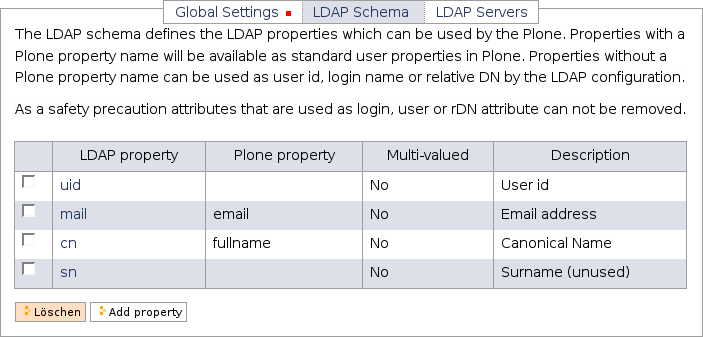
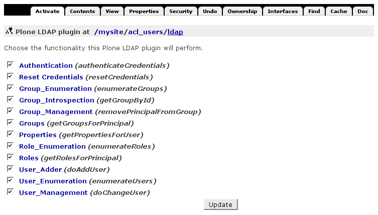
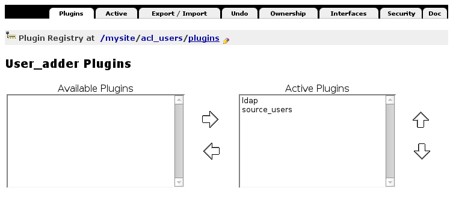

===============================
Plone mit LDAP-Server verbinden
===============================

Installation des ``python-ldap``-Moduls
=======================================

Um LDAP mit Python nutzen zu können, muss das ``python-ldap``-Modul installiert sein. Sie können testen, ob dieses Modul der Zope-Instanz zur Verfügung steht mit::

 $ ./bin/zopepy
 $ import _ldap

Sollten Sie keine Fehlermeldung erhalten. können Sie den Python-Interpreter wieder mit ``Strg-D`` (unter Windows ``Strg-Z``) verlassen.

Falls Sie eine Fehlermeldung erhalten, können Sie das ``python-ldap``-Modul einfach mit Buildout installieren. Überprüfen Sie zunächst, ob die erforderlichen Pakete bereits installiert sind:

OpenLDAP-Client
 ≥ Version 2.3
OpenSSL (optional)
 http://www.openssl.org/
cyrus-sasl (optional)
 http://asg.web.cmu.edu/sasl/sasl-library.html
Kerberos-Bibliotheken (optional)
 *MIT* oder *heimdal*

Für Debian und Ubuntu können Sie diese installieren mit::

    $ sudo apt-get install libldap2-dev libsasl2-dev libssl-dev

Anschließend können Sie Ihre ``base.cfg``-Datei folgendermaßen ändern::

    [buildout]
    parts =
        python-ldap
        ...

    [python-ldap]
    recipe = zc.recipe.egg:custom
    eggs = python-ldap
    find-links =
    include-dirs = /usr/include /usr/lib/sasl2
    library-dirs = /usr/lib

Die hier für ``include-dirs`` und ``library-dirs`` eingetragenen Pfade sind die für Ubuntu erforderlichen Angaben.

Weitere Informationen zur Installation des ``python-ldap``-Moduls erhalten Sie unter http://www.python-ldap.org/doc/html/installing.html.

Installation von ``plone.app.ldap``
===================================

Hierzu tragen wir in der ``setup.py``-Datei unseres Policy-Produkts folgendes
ein::

    setup(name='vs.policy',
        ...
        install_requires=[
            ...
              'plone.app.ldap',
        ],

Das ``plone.app.ldap``-Egg installiert automatisch die erforderlichen Produkte
`LDAPMultiPlugins <http://pypi.python.org/pypi/Products.LDAPMultiPlugins/>`_,
`LDAPUserFolder <http://pypi.python.org/pypi/Products.LDAPUserFolder/>`_,
`PloneLDAP <http://pypi.python.org/pypi/Products.PloneLDAP/>`_,
`dataflake.fakeldap <https://pypi.python.org/pypi/dataflake.fakeldap/>`_ und
`python-ldap <https://pypi.python.org/pypi/python-ldap/2.4.14>`_ mit.

Anschließend wird noch in der ``metadata.xml``-Datei des Policy-Produkts ``plone.app.ldap`` als Abhängigkeit eingetragen::

    <?xml version="1.0"?>
    <metadata>
        ...
        <dependencies>
            ...
            <dependency>profile-plone.app.ldap:ldap</dependency>
        </dependencies>
    </metadata>

Nachdem das Buildout-Projekt aktualisiert, die Zope-Instanz neu gestartet und
eine neue Plone-Site mit ``vs.policy`` hinzugefügt wurde, sollte sich *LDAP Connection* in *Website-Konfiguration*  konfigurieren lassen.

Konfiguration
=============

Anschließend erscheint in der *Website-Konfiguration* die Konfiguration der *LDAP Connection*:

.. plone-ldap-configuration.png
    :alt: Plone-LDAP-Konfiguration

LDAP-server type
    unterscheidet zwischen *LDAP* und *Active Directory*.
rDN attribute
    *relative distinguished name*, wird als erster Abschnitt des ``DN`` für in Plone angelegte Nutzer verwendet.

    Für *LDAP* wird hier meist ``uid`` angegeben, für *Active Directory* hingegen ``cn``.

user id attribute
    Attribut, das für die ID von Nutzern angegeben werden soll.

    Auch hier wird dasselbe wie für den *relative distinguished name* angegeben.

login name attribute
    wird während der Authentifizierung verwendet und ist üblicherweise dieselbe Angabe wie bei *user id attribute*.

    Bei einem *Active Directory*-Server kann entweder ``userPrincipalName`` oder ``sAMAccountName`` als *user id* und *login name* verwendet werden. Dabei wird für ``sAMAccountName`` nur der einfache Nutzername angegeben während ``userPrincipalName`` auch den Domainnamen enthält. ``sAMAccountName`` ist daher gut geeignet, wenn das Active Directory nur für eine Domain konfiguriert werden muss.

LDAP object classes
    Strukturelle Objektklasse und weitere Objektklassen, durch Komma getrennt. Diese Objektklassen werden in Plone neu hinzugefügten Nutzern zugewiesen. Das hier verwendete ``PilotPerson,uidObject`` ergibt eine einfaches Objekt mit einer ``uid``.

Bind DN
    ist der *distinguished name*, der von Plone verwendet wird um Zugang zum LDAP-Server zu erhalten. Wir verwenden den ``rootdn``::

        "cn=admin,dc=veit-schiele,dc=de"

Bind password
    ist das Passwort für den in *Bind DN* angegebenen Nutzer, in unserem Fall also das in der ``slpad.conf``-Datei angegebene Passwort ``1234``.

Base DN for users
    Ort im LDAP-Repository, an dem die Nutzer verwaltet werden. In unserem Fall in der *organizational unit* ``people``::

        ou=people,dc=veit-schiele,dc=de

Search scope for users
    Angabe, ob Nutzer direkt in der *organizational unit* gefunden werden oder auch in Untereinheiten. In unserem Fall könnten wir zwar ``one level`` angeben, ``subtree`` ist jedoch flexibler und wird daher üblicherweise verwendet.

Base DN for groups
    Ort im LDAP-Repository, an dem die Gruppen verwaltet werden. In unserem Fall in der *organizational unit* ``groups``::

        ou=groups,dc=veit-schiele,dc=de

Search scope for groups
    Angabe, ob Gruppen direkt in der *organizational unit* gefunden werden oder auch in Untereinheiten. Auch hier geben wir wie in *Search scope for users* ``subtree`` an.

LDAP-Schema
-----------

Im *LDAP Schema*-Reiter können LDAP-Attribute mit Eigenschaften der Plone-Nutzer verknüpft werden.

Üblicherweise wird das ``uid``-Attribut nicht mit einer Plone-Eigenschaft verknüpft, da es im *Global Settings*-Reiter frei als *rDN*, *user id* und *login name* angegeben werden soll.

Auch *sn* wird hier angegeben, jedoch nicht mit einer Plone-Eigenschaft verknüpft. Dies führt dazu, dass für jeden neu angelegten Plone-Nutzer ein leeres Feld im LDAP-Repository angelegt wird. Dennoch darf *sn* nicht aus der Plone-LDAP-Konfiguration gelöscht werden, da die *sn*-Eigenschaft zwingend für die *pilotPerson*-Objektklasse erforderlich ist.

Plone-Eigenschaften können mit LDAP-Attributen gemischt werden wobei der *Pluggable Authentication Service* (PAS) die LDAP-Eigenschaften bevorzugt.

LDAP-Server
-----------

Im *LDAP Server*-Reiter können ein oder mehrere LDAP-Server angegeben werden. Sind mehrere Server konfiguriert werden sie von oben nach unten durchsucht.

Um nun zu testen, ob die Plone-Site mit dem LDAP-Server kommuniziert, klicken Sie auf *Benutzer* in der Plone-Konfiguration und lassen sich anschließend alle Nutzer anzeigen. Nun sollten Ihnen die Nutzer aus dem LDAP-Server korrekt angezeigt werden.

**Anmerkung:** Der Nutzername für die Zope-Instanz, z.B. ``admin``, sollte nicht in Ihrem LDAP-Verzeichnis vorhanden sein.

Manuelle Konfiguration der PAS-Plugins
======================================

Die oben gezeigte LDAP-Konfiguration konfiguriert das ``ldap``-Plugin in ``acl_users``.

Hier lassen sich die einzelnen Funktionen der Nutzerverwaltung aktivieren bzw. deaktivieren. Beim Klicken in die Funktionen können diese auch konfiguriert werden. Schauen wir uns nun *User Adder* genauer an:

Auch hier werden die aktiven Plugins von oben nach unten durchsucht, d.h. die Nutzereigenschaften werden zunächst mit dem ``ldap``-Plugin und dann erst mit dem ``source_users``-Plugin gesucht.

Sollen in Plone angelegte Nutzer nicht in das LDAP-Repository übernommen werden, muss die Reihenfolge der beiden Plugins geändert werden.

Sollen neue Plone-Nutzer nicht in das LDAP-Repository übernommen werden, verschieben Sie das ``ldap``-Plugin in die *Available Plugins*.

.. Einen Überblick über die verschiedenen PAS-Plugins erhalten Sie in http://plone.org/documentation/manual/pas-reference-manual.

Alternative Ansätze
===================

- `Intranets with huge LDAPs
  <https://community.plone.org/t/intranets-with-huge-ldaps/>`_
- `chaoflow (Florian Friesdorf) <LDAP status quo and where to go from here>`_

  Three tier architecture:

  #. ldapy

     Low-level Python-Bibliothek, die `libldap
     <https://github.com/yykamei/python-libldap>`_ via `cffi
     <http://cffi.readthedocs.org/en/latest/>`_ undasynchrone Aufrufe via
     Generatoren unterstützt.

  #. `ldapalchemy <https://github.com/chaoflow/ldapalchemy>`_

     entsprechend sqlalchemy modelliert zur Unterstützung von Session-Management
     mit Connection-Pools und Abfrage der LDAP-Einträge mit Attributnamen und
     Typ-Mapping.

  #. pas.plugins.ldapalchemy

     PAS-Plugin, das unter Verwendung von ldapalchemy mit dem LDAP redet
