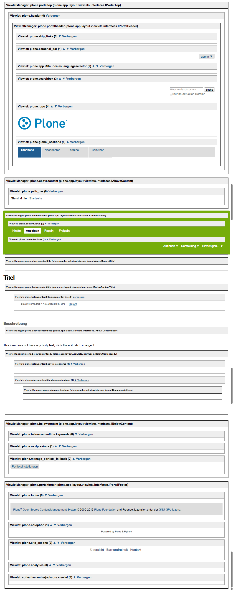

========
Viewlets
========

Viewlets und Viewlet-Manager konfigurieren
==========================================

Um sich einen Überblick über die verschiedenen Viewlet-Manager und Viewlets zu verschaffen, empfiehlt sich im Webbrowser der Aufruf der URL ``http://localhost:8080/mysite/@@manage-viewlets``.

Wie die Anzeige und Reihenfolge der Viewlets programmatisch verändert werden kann, können Sie sich in  ``src/vs.theme/vs/theme/profiles/default/viewlets.xml`` anschauen::

 <?xml version="1.0"?>
 <object>
     <order manager="plone.portaltop" skinname="vs.theme" based-on="Plone Default">
         <viewlet name="plone.header" />
     </order>

     <hidden manager="plone.portaltop" skinname="vs.theme">
         <viewlet name="plone.app.i18n.locales.languageselector" />
         <viewlet name="plone.path_bar" />
         <viewlet name="plone.personal_bar" />
     </hidden>

     <order manager="plone.portalheader" skinname="vs.theme" based-on="Plone Default">
         <viewlet name="plone.skip_links" />
         <viewlet name="plone.site_actions" />
         <viewlet name="plone.logo" />
         <viewlet name="plone.global_sections" />
     </order>

     <hidden manager="plone.portalheader" skinname="vs.theme">
         <viewlet name="plone.searchbox" />
     </hidden>

     <order manager="plone.contentviews" skinname="vs.theme" based-on="Plone Default">
         <viewlet name="vs.path_bar" />
         <viewlet name="vs.personal_bar" />
         <viewlet name="plone.contentviews" />
         <viewlet name="plone.contentactions" />
     </order>

     <hidden manager="plone.belowcontenttitle" skinname="vs.theme">
         <viewlet name="plone.belowcontenttitle.documentbyline" />
     </hidden>

     <hidden manager="plone.abovecontentbody" skinname="vs.theme">
         <viewlet name="plone.presentation" />
     </hidden>

     <order manager="plone.portalfooter" skinname="vs.theme" based-on="Plone Default">
         <viewlet name="vs.footer" />
         <viewlet name="plone.colophon" />
     </order>

     <hidden manager="plone.portalfooter" skinname="vs.theme">
         <viewlet name="plone.footer" />
     </hidden>

 </object>

``<order ...>``
 gibt die Reihenfolge der Viewlets an:

 ``skinname``
  beschränkt die angegebene Reihenfolge auf einen spezifischen Skin.

  Soll der entsprechende Manager für alle Skins verwendet werden, kann auch folgendes angegeben werden::

   skinname="*"

 ``based on``
  gibt an, auf welchem Skin die Reihenfolge basiert.

  Für die einzelnen Viewlets stehen auch noch die folgenden drei Angaben zur Verfügung:

  ``<viewlet name="my.viewlet" insert-before="another.viewlet" />``
   Das Viewlet wird unmittelbar vor einem spezifischen Viewlet eingefügt.
  ``<viewlet name="my.viewlet" insert-before="*" />``
   Das Viewlet wird vor allen anderen Viewlets eingefügt.
  ``<viewlet name="my.viewlet" insert-after="another.viewlet" />``
   Das Viewlet wird unmittelbar nach einem spezifischen Viewlet eingefügt.

``<hidden ...>``
 die hier angegebenen Views werden in diesem Viewlet-Manager nicht angezeigt.

Viewlet-Manager definieren
==========================

Viewlet-Manager werden in ``zcml``-Dateien angegeben. Wie dies geschieht, lässt sich leicht in ``plone/app/layout/viewlets/configure.zcml`` nachvollziehen, z.B. für ``plone.portaltop``::

 <browser:viewletManager
     name="plone.portaltop"
     provides=".interfaces.IPortalTop"
     permission="zope2.View"
     class="plone.app.viewletmanager.manager.OrderedViewletManager"
     />

Dabei ist das Interface ``IPortalTop`` definiert in ``plone/app/layout/viewlets/interfaces.py``. Allgemein dienen solche Interfaces dazu, Viewlets bestimmten Viewlet-Managern zuzuweisen.

In PageTemplates lassen sich Viewlet-Manager aufrufen z.B. mit::

 

Viewlets anderen Viewlet-Managern zuweisen
==========================================

In unserem Beispiel soll die *personal bar* vom ``plone.portaltop``- zum ``plone.contentviews``-Manager verschoben werden. Hierzu wird in ``src/vs.theme/vs/theme/browser/configure.zcml`` folgendes angegeben::

 <browser:viewlet
     name="vs.personal_bar"
     manager="plone.app.layout.viewlets.interfaces.IContentViews"
     layer=".interfaces.IThemeSpecific"
     class="plone.app.layout.viewlets.common.PersonalBarViewlet"
     permission="zope2.View"
     />

``personal_bar`` erhält einen anderen Namen, einen neuen Viewlet-Manager und wird mit ``layer`` an unser spezifisches Theme gebunden. Dieses ``IThemeSpecific``-Interface wurde bereits vom ``plone3_theme``-Template in ``browser/configure.zcml`` konfiguriert::

 <interface
    interface=".interfaces.IThemeSpecific"
    type="zope.publisher.interfaces.browser.IBrowserSkinType"
    name="vs.theme"
    />

Schließlich wird noch in ``src/vs.theme/vs/theme/profiles/default/viewlets.xml`` angegeben, dass das alte Viewlet nicht mehr und das neue in ``plone.contentviews`` angezeigt werden sollen::

 <hidden manager="plone.portaltop" skinname="vs.theme">
     …
     <viewlet name="plone.personal_bar" />
     …
 </hidden>
 …
 <order manager="plone.contentviews" skinname="vs.theme" based-on="Plone Default">
     <viewlet name="vs.personal_bar" />
     …
 </order>

Neue Viewlets erstellen
=======================

Neue Viewlets werden in ``browser.configure.zcml`` registriert, z.B. mit::

 <browser:viewlet
     name="vs.footer"
     manager="plone.app.layout.viewlets.interfaces.IPortalFooter"
     layer=".interfaces.IThemeSpecific"
     template="templates/footer.pt"
     permission="zope2.View"
     />

Mit der Angabe für ``layer`` wird der View an unser spezifisches Theme gebunden und mit ``template`` lässt sich auch ein eigenes Page Template angeben.

Viewlets überschreiben
======================

Die Pfadleiste (*breadcrumbs*) ist z.B. ein Viewlet. Um es ändern zu können, muss es zunächst in der Datei ``browser/configure.zcml`` registriert werden::

 <browser:viewlet
     name="vs.path_bar"
     manager="plone.app.layout.viewlets.interfaces.IContentViews"
     layer=".interfaces.IThemeSpecific"
     class=".viewlets.PathBarViewlet"
     permission="zope2.View"
     />

Der Name des Viewlets wird angegeben mit ``vs.path_bar`` und der Layer bindet das Viewlet an unser spezifisches Theme. Nun definieren wir noch die angegebene Klasse ``PathBarViewlet``, indem wir die Datei ``browser/viewlets.py`` mit folgendem Inhalt anlegen::

 from zope.component import getMultiAdapter
 from Products.Five.browser.pagetemplatefile import ViewPageTemplateFile
 from plone.app.layout.viewlets import common

 class PathBarViewlet(common.PathBarViewlet):
     render = ViewPageTemplateFile('templates/path_bar.pt')

Hier wird verwiesen auf ein PageTemplate ``browser/templates/path_bar.pt``.
