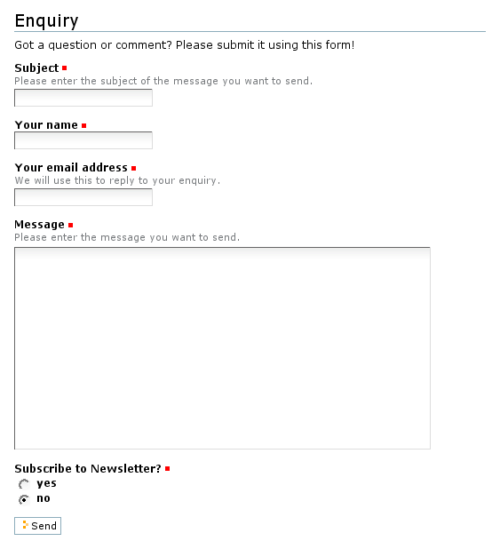

====================
Generierte Formulare
====================

Im Abschnitt `Portlet erstellen`_ haben wir bereits gesehen, wie mit ``zope.formlib`` aus einem Interface *add*- und *edit*-Formulare generiert wurden. Dies war jedoch nur ein Spezialfall, nun wollen wir die Formulargenerierung mit ``zope.formlib`` allgemeiner betrachten. Hierzu definieren wir zunächst einmal einen View in ``browser/configure.zcml``::

 <browser:page
     for="Products.CMFCore.interfaces.ISiteRoot"
     name="enquiry"
     class=".enquiry.EnquiryForm"
     permission="zope2.View"
     />

Anschließend definieren wir das Formular vollständig in ``browser/enquiry.py`` – es ist kein zusätzliches *Page Template* erforderlich::

 import re
 from zope.interface import Interface
 from zope import schema
 from zope.formlib import form
 from Products.Five.formlib import formbase
 from Products.Five.browser.pagetemplatefile import ViewPageTemplateFile
 from Products.statusmessages.interfaces import IStatusMessage
 from Acquisition import aq_inner
 from Products.CMFCore.utils import getToolByName
 from vs.registration import RegistrationMessageFactory as _

 # Define a valiation method for email addresses
 class NotAnEmailAddress(schema.ValidationError):
     __doc__ = _(u"Invalid email address")

 check_email = re.compile(r"[a-zA-Z0-9._%-]+@([a-zA-Z0-9-]+.)*[a-zA-Z]{2,4}").match
 def validate_email(value):
     if not check_email(value):
         raise NotAnEmailAddress(value)
     return True

 MESSAGE_TEMPLATE = """\
 Enquiry from: %(name)s <%(email_address)s>

 %(message)s
 """

 class IEnquiryForm(Interface):
     """Define the fields of our form
     """
     subject = schema.TextLine(title=_(u"Subject"),
                               required=True)
     name = schema.TextLine(title=_(u"Your name"),
                               required=True)
     email_address = schema.ASCIILine(title=_(u"Your email address"),
                                      description=_(u"We will use this to contact you if you request it"),
                                      required=True,
                                      constraint=validate_email)
     message = schema.Text(title=_(u"Message"),
                           description=_(u"Please keep to 1,000 characters"),
                           required=True,
                           max_length=1000)

Die ``constraint``-Eigenschaft des ``email_address``-Feldes sollte bei einem Aufruf ``True`` zurückgeben, wenn der Wert gültig ist. Andernfalls wird die in ``__doc__`` angegebene Fehlermeldung ausgegeben.

Eine Übersicht über die verfügbaren Felder und deren Optionen erhalten Sie in ``zope.schema.interfaces``.

Der View für das Formular wird dann abgeleitet aus der Basisklasse von ``zope.formlib``, die in einem Zope2-Produkt mittels ``Products.Five.formlib.formbase`` zur Verfügung steht::

 class EnquiryForm(formbase.PageForm):
     form_fields = form.FormFields(IEnquiryForm)
     label = _(u"Enquiry")
     description = _(u"Got a question? Please make an enquiry using the form below!")

- Die ``form_fields``-Variable enthält die darzustellenden Felder. Hier können auch eigene Widgets hinzugefügt oder Felder aus der Liste ausgenommen werden. Weitere Informationen hierzu erhalten Sie in den Interfaces ``IFormFields`` und ``IFormField`` in ``zope.formlib.interfaces``.
- ``label`` und ``description`` werden als Titel und Beschreibung oben auf der Seite dargestellt.

Mit ``__call__`` wird das Formular gerendert. Dabei ändern wir die übliche Darstellung indem der Rahmen und die Reiter beim Editieren nicht angezeigt werden::

 def __call__(self):
     self.request.set('disable_border', True)
     return super(EnquiryForm, self).__call__()

Anschließend wird die einzige Taste dieses Formulars angegeben::

 @form.action(_(u"Send"))
 def action_send(self, action, data):

Beim Abschicken des Formulars wird die *Decorator*-Funktion aufgerufen und die Werte des Formulars in das Wörterbuch ``data`` geschrieben.

Anschließend wird die E-Mail konstruiert::

     context = aq_inner(self.context)
     mailhost = getToolByName(context, 'MailHost')
     urltool = getToolByName(context, 'portal_url')
     portal = urltool.getPortalObject()
     email_charset = portal.getProperty('email_charset')

     to_address = portal.getProperty('email_from_address')
     source = "%s <%s>" % (data['name'], data['email_address'])
     subject = data['subject']
     message = MESSAGE_TEMPLATE % data

     mailhost.secureSend(message, to_address, str(source),
                         subject=subject, subtype='plain',
                         charset=email_charset, debug=False,
                         From=source)

Und schließlich wird auf die Startseite weitergeleitet und dort eine Statusmeldung angezeigt::

     confirm = _(u"Thank you! Your enquiry has been received and we will respond as soon as possible")
     IStatusMessage(self.request).addStatusMessage(confirm, type='info')

     self.request.response.redirect(portal.absolute_url())
     return ''

Eigene Widgets schreiben
========================

Wir wollen nun am Beispiel eines Boolschen Feld zum Abonnieren eines Newsletters zeigen, wie eigene Widgets definiert werden können. Hierzu erweitern wir zunächst unsere Schemadefinition::

 class IEnquiryForm(Interface):
     ...
     newsletter = schema.Bool(title=u'Subscribe to Newsletter?',
                              default=False,
                              required=True)

Nun können wir ein Widget definieren, wobei statt *True* und *False* die Werte *Yes* und *No* angezeigt werden sollen::

 from zope.schema import vocabulary as schemavocabulary
 from zope.app.form import browser as formbrowser

 def YesNoWidget(field, request, true=_('yes'), false=_('no')):
     vocabulary = schemavocabulary.SimpleVocabulary.fromItems(((true, True),
                                                          (false, False)))
     return formbrowser.RadioWidget(field, vocabulary, request)

Dieses Widget wird schließlich in der EnquiryForm-Klasse dem ``newsletter``-Feld zugewiesen::

 class EnquiryForm(formbase.PageForm):
     form_fields = form.FormFields(IEnquiryForm)
     form_fields['newsletter'].custom_widget = YesNoWidget
     ...

Das Formular sollte nun so aussehen:

Bestehende Widgets verwenden
============================

In ``plone.app.form`` stehen bereits diverse Widgets bereit:

``CheckBoxWidget``
 Plone-spezifisches Widget, das eine Checkbox links neben ``label`` anzeigt, mit dem die Felder ``title``, ``label`` und ``required`` ausgeblendet werden können.
``DateComponents``
 Ein *View*, der einige Hilfsmehtoden für Datumswidgets bereitstellt.
``LanguageDropdownChoiceWidget``
 Ein Dropdown-Widget, das eine lokalisierte Sprachauswahl darstellt.
``UberSelectionWidget``
 Widget zum Manipulieren von Auswahlfeldern.

 Ein Proof of Concept findet sich in https://svn.plone.org/svn/plone/CMFPlone/branches/plip124-ueberselection-widget/

``WYSIWYGWidget``
 Widget für die Verwendung des WYSIWYG-Editors Kupu zum Editieren von Formularfeldern.

 Um ein WYSIWYG-Feld in einem Formular anzuzeigen, kann z.B. in ``enquiry.py`` folgendes angegeben werden::

  from plone.app.form.widgets.wysiwygwidget import WYSIWYGWidget
  ...
  class IEnquiryForm(Interface):
  ...
      text = schema.Text(title=_(u"Text"),
                         description=_(u"A field which can contain rich text."),
                         required=True)
  ...
  class EnquiryForm(base.EditForm):
      form_fields = form.FormFields(IEnquiryForm)
      ...
      form_fields['text'].custom_widget = WYSIWYGWidget

Weitere Widgets finden Sie auch in `z3c.widget`_, u.a.:

Country selection Widgets
 Dropdown-Widget zur Auswahl eines Landes.
Date Selection Widget
 Das ``DateSelectWidget``-Widget bietet drei Auswahlboxen für Tag, Monat und Jahr.
Flash Upload Widget
 Konfigurierbares Flash-Frontend
Image Widget
 Dieses Widget kann als ``custom_widget`` verwendet werden um Bilder hochzuladen.

Site action für unser Formular
==============================

Schließlich fügen wir in ``vs.policy`` noch eine *site action* hinzu. Hierzu erstellen wir die Datei ``src/vs.policy/vs/policy/profiles/default/actions.xml`` mit folgendem Inhalt::

 <?xml version="1.0"?>
 <object name="portal_actions" meta_type="Plone Actions Tool"
         xmlns:i18n="http://xml.zope.org/namespaces/i18n">
     <object name="site_actions"
             meta_type="CMF Action Category">
         <object name="contact"
                 meta_type="CMF Action"
                 i18n:domain="vs.registration">
             <property name="title" i18n:translate="">Enquiry</property>
             <property name="description" i18n:translate=""></property>
             <property name="url_expr">string:$portal_url/@@enquiry</property>
             <property name="icon_expr"></property>
             <property name="available_expr"></property>
             <property name="permissions">
                 <element value="View"/>
             </property>
             <property name="visible">True</property>
         </object>
     </object>
 </object>

Dabei wird mit ``name="contact"`` die Aktion, die auf das Plone-Kontaktformular verweist, ersetzt.

.. note::
    In `Forms`_ erhalten Sie weitere Informationen zur ``zope.formlib``.

.. _`Forms`: http://pypi.python.org/pypi/zope.formlib/#forms
.. _`Portlet erstellen`: http://www.veit-schiele.de/dienstleistungen/technische-dokumentation/plone-entwicklerhandbuch/artikeltypen/portlet-erstellen.html

.. _`z3c.widget`: http://pypi.python.org/pypi/z3c.widget
