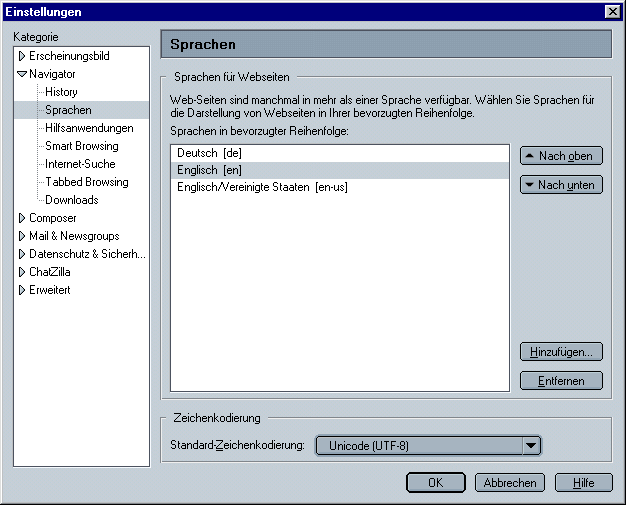

Spracheinstellungen
===================

Das Plone User Interface ist bereits in viele Sprachen übersetzt worden. Die Übersetzungen werden jedoch nicht mit Plone selbst mitgeliefert, sondern in einem eigenen Modul:

- Bis zu Version Plone 3.1 in `Plone Translations`_,
- ab Version Plone 3.3 in `plone.app.locales`_.

Üblicherweise erhalten Sie je nach Spracheinstellung ihres Browsers die entsprechende Sprache für das Plone-Interface angezeigt.

Da vermutlich jedoch die wenigsten Betrachter ihrer Website  bewusst die Spracheinstellung in ihrem Browser vorgenommen haben, gibt es mit dem *Plone Language Tool* ein Produkt, das vielfältige Spracheinstellungen für eine Plone-Sie ermöglicht.

Plone Language Tool
-------------------

Das `Plone Language Tool`_ kann, nachdem es im *Products*-Ordner ihrer Zope-Instanz installiert wurde, in der Plone-Konfiguration unter *Produkte hinzufügen/entfernen* für jede Plone-Site installiert werden.

.. figure: :plone-language-tool.png
    :alt: Plone Language Tool

Anschließend können sie folgende Spracheinstellungen vornehmen:

Standardsprache [engl.: Default language)
 Die hier ausgewählte Sprache wird verwendet sofern die vom Nutzer bevorzugte Sprache nicht verfügbar ist.
Erlaubte Sprachen (engl.: Allowed languages)
 Hier können sie diejenigen Sprachen angeben, die in ihrer Website ausgewählt werden können.

 Verwenden Sie die *ctrl*-Taste zum Aus- und Abwählen der einzelnen Sprachen.

 Erlauben spezifischer Sprachvarianten wie ``de_DE``, ``de-AT`` und ``de-CH``.

 Anzeigen von Flaggen für die Sprachauswahl.

Verhandlungsschema (engl.: *Negotiation Scheme*)
 Die Reihenfolge, in der die Sprache ausgehandelt wird.

 #. Sollen Sprachcodes in der URL für Sprachangaben des Betrachters verwendet werden?
 #. Sollen Cookies für die Sprachangaben des Betrachters verwendet werden?
 #. Soll die Spracheinstellung des Browsers berücksichtigt werden?
 #. Die voreingestellte Standardsprache (s.o.) wird verwendet.

Kontrolleinstellungen für die Inhalte
 Einstellungen, die auf mehrsprachigen **Inhalt** zutreffen.

 #. Erzwinge unterschiedliche URL’s für jede Sprache (Umleitung).
 #. Erlaube, auf eine andere Sprache auszuweichen, sollte dieses von der Implementierung unterstützt werden.
 #. Erstelle Artikel anfänglich als sprachneutral.

Dies Einstellungen können auch im Profil ``profiles/default/portal_languages.xml`` vorgenommen werden::

 <?xml version="1.0"?>
 <object name="portal_languages" meta_type="Plone Language Tool">
  <default_language value="en"/>
  <use_content_negotiation value="False"/>
  <use_path_negotiation value="False"/>
  <use_cookie_negotiation value="True"/>
  <authenticated_users_only value="False"/>
  <use_request_negotiation value="False"/>
  <use_cctld_negotiation value="False"/>
  <use_subdomain_negotiation value="False"/>
  <use_combined_language_codes value="False"/>
  <display_flags value="False"/>
  <start_neutral value="False"/>
  <supported_langs>
   <element value="en"/>
   <element value="de"/>
  </supported_langs>
 </object>

Testen
------

::

 def testLanguageSettings(self):
     default_language = self.portal.portal_languages.getDefaultLanguage()
     self.assertEqual(default_language == 'de', True)
     # return [(country code, countryname), ...]
     supported_languages = [r[0] for r in self.portal.portal_languages.listSupportedLanguages()]
     self.assertEqual('en' in supported_languages, True)
     self.assertEqual('de' in supported_languages, True)

.. _`Plone Translations`: http://plone.org/products/plonetranslations
.. _`plone.app.locales`: http://pypi.python.org/pypi/plone.app.locales
.. _`Plone Language Tool`: http://plone.org/products/plonelanguagetool
