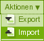

=====
GSXML
=====

GSXML nutzt GenericSetup um ATCT-basierte Inhalte als XML-Daten im- und exportieren zu können.

Anforderungen
=============

`GSXML`_ benötigt

- `lxml`_

  lxml kann folgendermaßen installiert werden:

  #. Zunächst wird folgende Änderung in der ``buildout.cfg``-Datei vorgenommen::

      [buildout]
      ...
      extends =
          ...
          lxml.cfg

  #. Die ``lxml.cfg``-Datei sieht dann folgendermaßen aus::

      [lxml]
      parts =
         staticlxml
         pylxml

      [pylxml]
      recipe=zc.recipe.egg
      interpreter=pylxml
      eggs=
          lxml

      [staticlxml]
      recipe = z3c.recipe.staticlxml
      egg = lxml

  #. Nun sollte Buildout problemlos durchlaufen und die Instanz neu gestartet werden können::

      $ ./bin/buildout
      $ ./bin/instance fg

Installation
============

GSXML kann einfach als Egg installiert werden::

 [buildout]
 ...
 eggs =
     elementtree
     collective.plone.gsxml
     ...

Anschließend wird das Egg noch im ``[instance]``-Abschnitt angegeben::

 [instance]
 ...
 zcml=
     collective.plone.gsxml
     ...

Nachdem das Buildout-Skript erneut durchlaufen und die Instanz gestartet wurde kann GSXML einfach mit dem Quickinstaller für die Plone-Site installiert werden. Anschließend erscheinen im *Aktionen*-Menü die Einträge *Export* und *Import*:

.. _`GSXML`: http://pypi.python.org/pypi/collective.plone.gsxml
.. _`lxml`: http://www.codespeak.net/lxml
