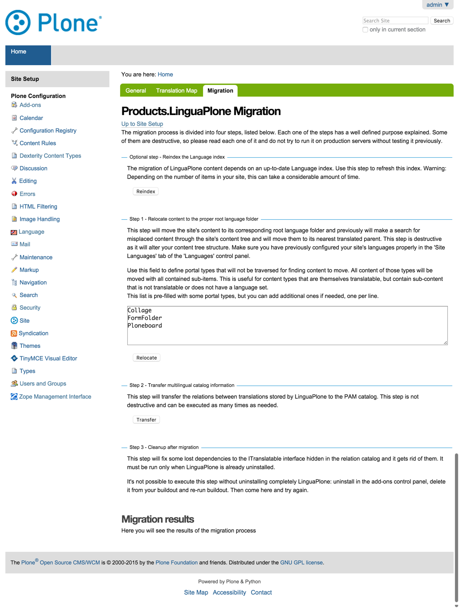

LinguaPlone-Migration
=====================

Für die Migration einer Plone-Site mit LinguaPlone zu `plone.app.multilingual
<https://github.com/plone/plone.app.multilingual>`_ sind zunächst einmal beide
Produkte zu installieren. Hierfür wird die Buildout-Konfiguration der Plone-
4.3-Site entsprechend geändert, z.B. in der ``devel.cfg``::

    [instance-base]
    eggs +=
        ...
        Products.LinguaPlone
        plone.app.multilingual

… und in der ``versions.cfg``::

        [versions]
        ...
        Products.LinguaPlone = 4.1.3
        plone.app.multilingual =  2.0.0

Siehe hierfür auch `github.com/veit/vs_buildout/commit <https://github.com/veit/vs_buildout/commit/ea0a5496ac638f60da2b1b870ed74ca1a52c4dff>`_.

Anschließend wird das Buildout-Skript aufgerufen und die Instanz neu gestartet. Nun
kann in der Plone-4.3-Site ``plone.app.multilingual`` aktiviert und ``LinguaPlone``
deaktiviert werden. Anschließend sollten im *language controlpanel* im *Migration*-
Reiter die folgenden vier Schritte ausgeführt werden:

#. Reindexieren des Sprachindex (optional)

   Die Migration von LinguaPlone basiert auf einem aktuellen Sprachindex.

#. Zuordnen der Inhalte zum passenden *root language*-Ordner

   In diesem Schritt werden die Inhalte in die entsprechenden *root language*-
   Ordner verschoben.

#. Übertragen der Referenzen aus dem LinguaPlone-Katalog in den
   ``plone.app.multilingual``-Katalog
#. Aufräumen nach der Migration
   Dieser Schritt sucht und repariert verlorene Verknüpfungen.

   Dieser Schritt ist nur erforderlich wenn LinguaPlone nicht installiert ist.
   Daher wird dieser Schritt auch nur dann angezeigt.
