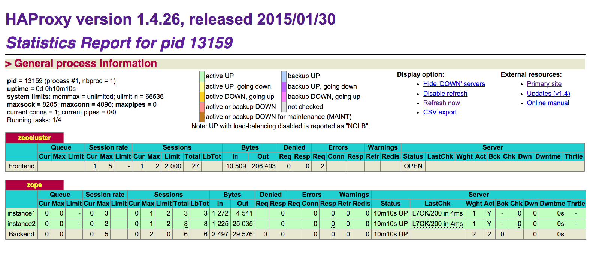

==========================
Lastverteilung mit HAProxy
==========================

Mit :doc:`../../caching/varnish` lässt sich zwar eine einfache Lastverteilung
im *Round-Robin*-Verfahren realisieren, für zuverlässige Hochverfügbarkeit sind
jedoch aufwendigere Verfahren notwendig.

Dies kann mit `HAProxy <http://www.haproxy.org/>`_ realisiert werden. Dabei
lässt sich HAProxy einfach mit Buildout installieren::

    [haproxy-build]
    recipe = plone.recipe.haproxy
    url = http://www.haproxy.org/download/1.4/src/haproxy-1.4.26.tar.gz
    target = linux26
    cpu = i686
    pcre = 1

    [haproxy-config]
    recipe = collective.recipe.template
    input = ${buildout:directory}/templates/haproxy.conf.in
    output = ${buildout:directory}/etc/haproxy.conf
    user = haproxy
    group = haproxy
    frontend-host = 127.0.0.1
    frontend-port = 8001

Die ``haproxy.conf.in``-Datei in ``templates`` sieht dann z.B. so aus::

    global
      maxconn  ${haproxy-conf:maxconn}
      user ${haproxy-config:user}
      group ${haproxy-config:group}
      daemon
      nbproc 1
      spread-checks 3
      ulimit-n 65536

    defaults
      mode http

      # The zope instances have maxconn 1, and it is important that
      # unused/idle connections are closed as soon as possible.
      option httpclose

      # Remove requests from the queue if people press stop button
      option abortonclose

      retries 3
      option redispatch
      monitor-uri /haproxy-ping

      timeout connect 5s
      timeout queue 30s
      timeout client 50s
      timeout server 120s
      timeout check 50s
      stats enable
      stats uri /haproxy-status
      stats refresh 60s
      stats realm Haproxy\ statistics

    frontend zeocluster
      bind ${haproxy-config:frontend-host}:${haproxy-config:frontend-port}
      default_backend zope

      option httplog
      log 127.0.0.1:1514 local6

      # Load balancing over the zope instances
      backend zope
      # Use Zope's __ac cookie as a basis for session stickiness if present.
      appsession __ac len 32 timeout 1d
      # Otherwise add a cookie called "serverid" for maintaining session stickiness.
      # This cookie lasts until the client's browser closes, and is invisible to Zope.
      cookie serverid insert nocache indirect
      # If no session found, use the roundrobin load-balancing algorithm to pick a backend.
      balance roundrobin
      # Use / (the default) for periodic backend health checks
      option httpchk GET /

      # Server options:
      # "maxconn" is how many connections can be sent to the server at once
      # "check" enables health checks
      # "rise 1" means consider Zope up after 1 successful health check
      server instance1 127.0.0.1:${instance1:http-address} weight 1 check inter 15s rise 2 fall 1 maxconn 2
      server instance2 127.0.0.1:${instance1:http-address} weight 1 check inter 15s rise 2 fall 1 maxconn 2

HAProxy kann dann gestartet werden mit::

    ${buildout:directory}/bin/haproxy -f ${buildout:directory}/etc/haproxy.conf -db

Unter http://localhost:8001/haproxy-status können Sie sich dann den aktuellen
Status des HAProxy anschauen:

.. seealso::
    * `Analyze ALOHA’s HAProxy logs with halog
      <https://www.haproxy.com/static/media/uploads/eng/resources/appnotes_0054_analyze_haproxy_logs_with_halog_en.pdf>`_

.. - `Using HAProxy with Zope via Buildout <http://david.wglick.org/2010/using-haproxy-with-zope-via-buildout/>`_
   - `regebro/Plone-Buildout-Example <https://github.com/regebro/Plone-Buildout-Example>`_
