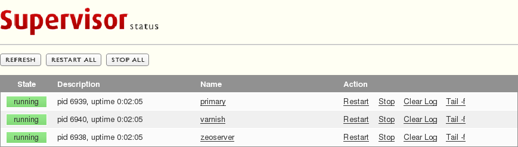

=========================================
Supervisor Installation und Konfiguration
=========================================

Supervisor ist ein Client/Server-System, das die Prozessüberwachung und -kontrolle auf Unix-Betriebssystemen erlaubt.

Dieses Python-Programm erlaubt ``start``, ``stop`` und ``restart`` anderer
Programme auf UNIX-Systemen wobei es auch abgestürzte Prozesse erneut
starten kann.

Supervisor-Komponenten
======================

``supervisord``
    *daemon*-Prozess, der andere Programme als Kind-Prozesse laufen lässt.
``supervisorctl``
    Client-Programm, das den Status der ``supervisord``-Kind-Prozesse
    kontrolliert und mitloggt
Web-Interface
    für start, stop, restart und Ansicht der Log-Dateien.

Supervisor-Konfiguration
========================

Die Supervisor-Konfigurationsdatei ``etc/supervisord.conf`` kann z.B.
folgendermaßen aussehen::

    [unix_http_server]
    file=%(here)s/../var/supervisor.sock
    chmod=0600

    [supervisorctl]
    serverurl=unix://%(here)s/../var/supervisor.sock

    [rpcinterface:supervisor]
    supervisor.rpcinterface_factory=supervisor.rpcinterface:make_main_rpcinterface

    [supervisord]
    logfile=%(here)s/../var/log/supervisord.log
    logfile_maxbytes=5MB
    logfile_backups=10
    loglevel=info
    pidfile=%(here)s/../var/supervisord.pid ;
    childlogdir=%(here)s/../var/log
    nodaemon=false              ; (start in foreground if true; default false)
    minfds=1024                 ; (min. avail startup file descriptors; default 1024)
    minprocs=200                ; (min. avail process descriptors; default 200)
    directory=%(here)s

    [program:zeoserver]
    command = %(here)s/../bin/zeoserver fg
    autostart= true
    autorestart = true
    startsecs = 10
    priority = 100

    [program: instance]
    command = %(here)s/../bin/instance console
    startsecs = 60
    priority = 2
    redirect_stderr = true
    autostart= true
    autorestart = true
    priority = 500

    [groups]
    programs = instance

    [program:varnish]
    command = %(here)s/../bin/varnish -F
    autostart= true
    autorestart = true
    priority = 1000

`Supervisor <http://supervisord.org/>`_ kann einfach mit Buildout
installiert werden::

    [buildout]
    parts =
       ...
       supervisor

    [supervisor]
    recipe = zc.recipe.egg
    eggs = supervisor

Nun kann Buildout aufgerufen und anschließend Supervisor gestartet werden::

    $ ./bin/buildout
    $ ./bin/supervisord

Schließlich können Sie Zeo-Server und -Client mit einem Aufruf starten und
stoppen::

    $ ./bin/supervisorctl start all
    $ ./bin/supervisorctl stop all

Monitoring
==========

In ``etc/supervisord.conf`` lässt sich auch ein Monitoring-Server
konfigurieren::

    [inet_http_server]
    port=127.0.0.1:9001
    username=admin
    password=secret

Und im Abschnitt ``[supervisorctl]`` muss noch die ``serverurl`` geändert
werden::

    [supervisorctl]
    serverurl = http://localhost:9001

Dann starten Sie Supervisor und geben Nutzername und Passwort ein::

    $ ./bin/supervisord
    $ ./bin/supervisorctl
    Server requires authentication
    Username:admin
    Password:

    instance                        STARTING
    varnish                         RUNNING    pid 21683, uptime 0:00:10
    zeoserver                       STARTING

In Ihrem Web-Browser können Sie nun unter ``http://localhost:9001`` die
Prozesse steuern und die Log-Dateien ansehen:

|Supvervisor status|

Der ``supervisord``-Prozess lässt sich beenden mit::

    supervisor> shutdown
    Really shut the remote supervisord process down y/N? y
    Shut down

Und anschließend kann auch der ``supervisorctl``-Prozess beendet werden mit ``Strg-D``.

.. s.a. `Control production buildouts with supervisor <http://www.webmeisterei.com/friessnegger/2008/06/03/control-production-buildouts-with-supervisor/>`_
