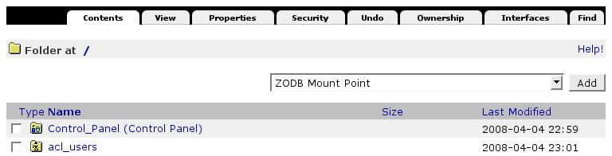
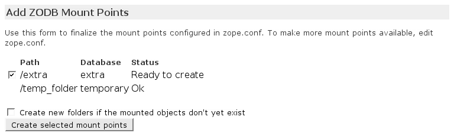

===================
ZODBs konfigurieren
===================

Mehrere Storages verwalten
==========================

Jede Zope-Instanz kann mehrere Zope-Datenbanken (ZODB) verwalten. Das Hinzufügen einer neuen ZODB erfolgt in der ``deploy.cfg``-Datei, z.B.::

 [zeoserver]
 ...
 zeo-conf-additional =
     <filestorage extra>
         path  ${buildout:directory}/var/filestorage/Extra.fs
     </filestorage>

 [instance]
 ...
 zope-conf-additional =
     <zodb_db extra>
         # Extra database
         cache-size 10000
         allow-implicit-cross-references false
     # ZEOStorage database
         <zeoclient>
           server ${zeoserver:zeo-address}
           storage extra
           name zeostorage
           var ${buildout:directory}/var
           cache-size 500MB
         </zeoclient>
         mount-point /extra
     </zodb_db>

 [instance2]
 ...
 zope-conf-additional =
     ${instance:zope-conf-additional}
     zserver-threads 1

``filestorage``-Abschnitt
-------------------------

``path``
 Pfadangabe der Speicherdatei. Die Pfadangaben weiterer Dateien wie ``index``- und ``lock``-Dateien werden daraus berechnet.
``read-only``
 Ist die Angabe ``true``, sind nur Lesezugriffe auf diesen Speicher erlaubt. Beachten Sie, dass die ``pack``-Operation nicht als schreibender Zugriff angesehen wird und weiterhin erlaubt bleibt.
``quota``
 Maximal zulässige Größe des Speichers. Operationen, die die angegebene Größe überschreiten würden, führen zu einem ``ZODB.FileStorage.FileStorageQuotaError``.

``zodb_db``-Abschnitt
---------------------

``cache-size``
 Die Anzahl der Objekte, die für jede Verbindung zwischengespeichert werden können.

 Der Standardwert beträgt ``5000``.

``pool-size``
 Die erwartete maximale Anzahl gleichzeitig offener Verbindungen. Dies ist keine harte Begrenzung, jedoch führt eine größere Anzahl von Verbindungen zu einem ``warn``-Eintrag in der Log-Datei.
``mount-point``
 Pfadangabe in dem die Datenbank im Zope-Server eingehängt wird.

 Unterscheidet sich die Angabe für den ZEO-Server von der des mount-point, kann folgende Notation verwendet werden::

  path_on_client:path_on_zeo_server

``zeoclient``-Abschnitt
-----------------------

``storage``
 Verwaltet der ZEO-Server mehr als einen Speicher, wird für den ZEO-Client der Name des Speichers angegeben, den der benutzen möchte. Der Standardwert für ist ``1``, der für die ``main``-ZODB vergeben wird.
``name``
 Der Name des Speichers. Wird keine Angabe gemacht, wird die Adresse des Servers verwendet.
``var``
 Das Verzeichnis, in dem die persistenten Cache-Dateien gespeichert werden. Üblicherweise werden die Cache-Dateien im aktuellen Verzeichnis gespeichert.
``cache-size``
 Die maximale Größe des Client-Cache in bytes, KB oder MB.

 Der Standardwert beträgt ``20 MB``.

``read-only``
 Markierung, die anzeigt, ob dies ein Speicher mit ausschließlichem Lesezugriff ist.

 Der Standardwert ist ``false``.

Eine Übersicht über verfügbare Angaben erhalten Sie in ``parts/zope2/lib/python/ZODB/component.xml``.

Damit die Konfiguration wirksam wird, muss nun das Buildout-Skript erneut aufgerufen werden::

 $ ./bin/buildout -Noc deploy.cfg

Schließlich kann im Zope Management Interface (ZMI) ein neuer *Mount Point* hinzugefügt werden.

collective.recipe.filestorage
=============================

`collective.recipe.filestorage`_ ist ein Rezept zum Verwalten mehrerer ZODBs::

 [buildout]
 parts =
     filestorage
     ...

 [filestorage]
 recipe = collective.recipe.filestorage
 parts =
     extra
     super

``parts``
 Eine Liste von filestorage-Abschnitten. Im Gegensatz zu ``[buildout]``-Abschnitten muss jeder Abschnitt in einer neuen Zeile beginnen.
``zeo``
 Der Name der ``plone.recipe.zope2zeoserver`` oder ``plone.recipe.zeoserver``-Abschnitte, für die zusätzliche Filestorages definiert werden sollen.

 Der Standardwert ist der erste Abschnitt in der Buildout-Konfiguration.

``zopes``
 Eine Liste der Abschnitte, die ``plone.recipe.zope2instance`` verwenden und in denen die Filestorages hinzugefügt werden sollen.

 Üblicherweise werden alle Abschnitte mit ``plone.recipe.zope2instance`` hinzugefügt, die dem zugehörigen ``zeoserver``-Abschnitt zugeordnet sind.

``zodb-cache-size``
 Die Zahl der Objekte, die maximal im ZODB-Cache gehalten werden sollen.

 Der Standardwert ist ``5000``.

``zodb-name``
 Der Name der ZODB.

 Der Standardwert ist``%(fs_part_name)s``.

``zodb-mountpoint``
 Der Pfad zu den Mount-Points.

 Der Standardwert ist ``/%(fs_part_name)s``.

 Wollen Sie z.B. jeder Datei noch die Endung ``_mountpoint`` hinzufügen, ist die Angabe ``/%(fs_part_name)s_mountpoint``.

``zeo-address``
 Port des zugehörigen ZEO-Servers.

 Der Standardwert ist ``8100``.

 Sinnvollerweise wird er jedoch aus dem ``zeoserver``-Abschnitt genommen::

  ${zeoserver:zeo-address}

``zeo-client-cache-size``
 Die maximale Größe des ZEO-Client-Cache in ``bytes``, ``KB`` oder ``MB``.

 Der Standardwert ist ``30MB``.

``zeo-storage``
 Die ID des ZEO-Storages.

 Standardwert ist ``%(fs_part_name)s``.

 Soll dem Namen noch die Endung ``_storage`` hinzugefügt werden, so muss ``%(fs_part_name)s_storage`` angegeben werden.

``zeo-client-name``
 Der Name des ZEO-Client.

 Der Standardwert ist ``%(fs_part_name)s_zeostorage``.

Weitere Konfigurationsmöglichkeiten sind in `Supported options`_ beschrieben.

.. _`collective.recipe.filestorage`: http://pypi.python.org/pypi/collective.recipe.filestorage
.. _`Supported options`: http://pypi.python.org/pypi/collective.recipe.filestorage#supported-options

Plone 4
=======

In Plone 4 werden Bilder und Dateien als *Binary Large Objects (BLOBs)* im Dateisystem abgelegt. Daher sind auch für die jeweiligen Mount-Points passende Speicherorte im Dateisystem anzugeben. Hierbei vereinfacht ``collective.recipe.filestorage`` die Buildout-Konfiguration erheblich, da die Angaben für jeden einzelnen Mount-Point nicht mehr im ``zeoserver``-und jedem ``instance``-Abschnitt angegeben werden müssen::

 [buildout]
 parts =
     filestorage
     ...

 [filestorage]
 recipe = collective.recipe.filestorage
 blob-storage = ${buildout:directory}/var/blobstorage-%(fs_part_name)s
 parts =
     extra

 [zeoserver]
 ...
 blob-storage = ${buildout:directory}/var/blobstorage-%(fs_part_name)s
