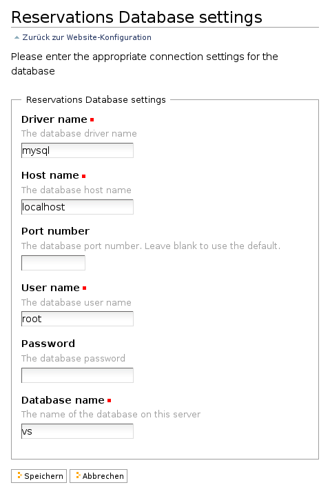

======================
Konfigurationsformular
======================

Um die Datenbankeinstellungen konfigurierbar zu machen, erstellen wir eine spezielle Website-Konfigurationsseite. Wir werden hierzu ``zope.formlib`` und folgendes Interface verwenden::

 class IDatabaseSettings(Interface):
     """Database connection settings.
     """

     drivername = schema.ASCIILine(title=_(u"Driver name"),
                                   description=_(u"The database driver name"),
                                   default='mysql',
                                   required=True)

     hostname = schema.ASCIILine(title=_(u"Host name"),
                                 description=_(u"The database host name"),
                                 default='localhost',
                                 required=True)

     port = schema.Int(title=_(u"Port number"),
                       description=_(u"The database port number. Leave blank to use the default."),
                       required=False)

     username = schema.ASCIILine(title=_(u"User name"),
                                 description=_(u"The database user name"),
                                 required=True)

     password = schema.Password(title=_(u"Password"),
                                description=_(u"The database password"),
                                required=False)

     database = schema.ASCIILine(title=_(u"Database name"),
                                 description=_(u"The name of the database on this server"),
                                 required=True)

Für das Formular selbst nutzen wir dann die Infrastruktur von ``plone.app.controlpanel`` in ``vs.registration/vs/registration/browser/dbsettings.py`` verwendet::

 from zope.component import getUtility
 from zope.formlib import form

 from plone.app.controlpanel.form import ControlPanelForm

 from collective.lead.interfaces import IDatabase

 from vs.registration.interfaces import IDatabaseSettings
 from vs.registration import RegistrationMessageFactory as _

 def reservations_database_settings(context):
     return getUtility(IDatabaseSettings)

 class ReservationsDatabaseControlPanel(ControlPanelForm):
     form_fields = form.FormFields(IDatabaseSettings)

     form_name = _(u"Reservations Database settings")
     label = _(u"Reservations Database settings")
     description = _(u"Please enter the appropriate connection settings for the database")

     def _on_save(self, data):
         db = getUtility(IDatabase, name='vs.reservations')
         db.invalidate()

``reservations_database_settings``
 Der Adapter bindet die Werte aus dem Konfigurationsformular an ``context``, also an Plone Site Root.
``ReservationsDatabaseControlPanel``
 Die Klasse definiert den View für das Formular, das ``zope.formlib`` aus dem ``IDatabaseSettings``-Interface generiert.
``_on_save``
 Funktion, die von der Basisklasse aufgerufen wird sobald auf *Speichern* geklickt wird. Dabei leert die ``invalidate``-Methode alle internen Caches, sodass die neuen Einstellungen wirksam werden.

Anschließend werden in  ``vs.registration/vs/registration/browser/configure.zcml`` Icon, View und Adapter registriert::

 <browser:resource
     name="dbsettings_icon.gif"
     image="dbsettings_icon.gif"
     />

 <browser:page
     name="reservations-database-controlpanel"
     for="Products.CMFPlone.interfaces.IPloneSiteRoot"
     class=".dbsettings.ReservationsDatabaseControlPanel"
     permission="cmf.ManagePortal"
     />

 <adapter
     for="Products.CMFPlone.interfaces.IPloneSiteRoot"
     provides="vs.registration.interfaces.IDatabaseSettings"
     factory=".dbsettings.reservations_database_settings"
     />

Damit das Konfigurationsformular auf der Plone-Konfigurationsseite angezeigt wird, wird die Datei ``vs.registration/vs/registration/profiles/default/controlpanel.xml`` mit folgendem Inhalt erstellt::

 <?xml version="1.0"?>
 <object name="portal_controlpanel" meta_type="Plone Control Panel Tool">
     <configlet title="Reservations Database" action_id="ReservationsDatabase"
                appId="ReservationsDatabase" category="Products" condition_expr=""
                url_expr="string:${portal_url}/@@reservations-database-controlpanel"
                visible="True">
         <permission>Manage portal</permission>
     </configlet>
 </object>

Nun wird noch das Icon in ``vs.registration/vs/registration/profiles/default/actionicons.xml`` registriert::

 <?xml version="1.0"?>
 <action-icons>
     <action-icon category="controlpanel"
                  action_id="ReservationsDatabase"
                  title="Reservations Database"
                  priority="0" icon_expr="++resource++dbsettings_icon.gif"/>
 </action-icons>

Beachten Sie bitte, dass das ``action_id``-Attribut in beiden Profilen gleich ist. Und so sieht das Plone-Konfigurationsformular aus:

