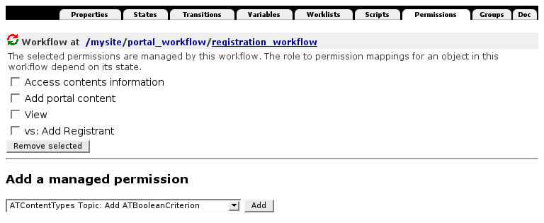

==============
Arbeitsabläufe
==============

Arbeitsabläufe (Workflows) erlauben, lokal die Rechte für Inhaltsobjekte zu verändern, ohne die Rechte für jedes dieser Objekte einzeln ändern zu müssen. Damit bleibt die Rechteverwaltung  übersichtlich.

Die Arbeitsabläufe selbst werden für eine Site zentral im *Workflow Tool* (``portal_workflow``) verwaltet. Zunächst werden Sie den *Workflows*-Reiter sehen, in dem den verschiedenen Artikeltypen Arbeitsabläufe zugeordnet werden. Die Definitionen der Arbeitsabläufe lassen sich im *Contents*-Reiter anschauen. Jeder der Arbeitsabläufe besteht aus verschiedenen Stadien (*states*), wie z.B. *private* oder *published*, und Übergängen (*transitions*) zwischen ihnen.

Visualisierung von Workflows
============================

Mit `collective.workflowed`_ gibt es einen Javascript-basierten graphischen Editor für Arbeitsabläufe, der in Plones Website-Konfiguration aufgerufen werden kann. Die dort editierten Workflows können anschließend im Generic Setup Tool exportiert und in das eigene Produkt integriert werden.

.. _`collective.workflowed`: http://plone.org/products/collective-workflowed

.. _`Products.DCWorkflowGraph`: http://pypi.python.org/pypi/Products.DCWorkflowGraph

.. Mit `Products.DCWorkflowGraph`_ steht Ihnen ein Werkzeug zur Verfügung, das mithilfe von Graphviz die Plone-Workflows darstellt:

 |Intranet-Workflow-Graph|

 .. |Intranet-Workflow-Graph| image:: intranet-workflow-graph.gif/image_preview
 .. _`dot`: http://de.wikipedia.org/wiki/DOT_%28GraphViz%29

 Zum Installieren von ``Products.DCWorkflowGraph`` tragen Sie bitte folgendes in Ihre Buildout-Konfigurationsdatei ein::

  [buildout]
  parts =
      ...
      graphviz
  ...
  eggs =
      ...
      Products.DCWorkflowGraph

  [instance]
  ...
  eggs =
      Plone
      ${buildout:eggs}
  ...
  zope-conf-additional =
      <environment>
          PATH ${buildout:directory}/parts/graphviz/bin
     </environment>

  [graphviz]
  recipe = zc.recipe.cmmi
  url = http://www.graphviz.org/pub/graphviz/stable/SOURCES/graphviz-working.tar.gz

 Nun können Sie das Buildout-Skript erneut durchlaufen und die Instanz starten. Wählen Sie nun im ZMI Ihrer Plone-Site das *Plone Workflow Tool* und dort im *Contents*-Reiter den zu analysierenden Workflow aus. Wenn Sie nun in den *graph*-Reiter klicken, erhalten Sie eine Seite mit dem Workflow-Graphen und folgenden Optionen:

 *Only Show Ids*
  zeigt nicht die Titel der Stadien und Übergänge an
 *Translate Graph*
  übersetzt die Titel der Stadien und Übergänge
 *update*
  aktualisert den Graphen
 *download dot file*
  gibt eine `dot`_-Datei aus.

Workflows und Berechtigungen
============================

Solche Übergänge können durch bestimmte Rechte, Rollen und Gruppen geschützt werden.

**Anmerkung 1:** Wie schon an früherer Stelle bemerkt, sollten die Sicherheitseinstellungen durch die Zuweisung entsprechender Rechte (*Permissions*) erfolgen, **nicht** durch die Zuweisung von Rollen oder Gruppen.

Für jedes Stadium können eine Reihe von Rechten angegeben werden, die für ein entsprechendes Inhaltsobjekt gelten. Die in einem Arbeitsablauf zu vergebenden Rechte werden im *Permissions*-Reiter für jeden Workflow angegeben:

Beachten Sie bitte, dass Änderungen an den Rechten keinen unmittelbaren Einfluss auf die Rechte bestehender Objekte haben. Hierzu müssen in *Plone-Konfiguration → Artikeltypen* zunächst die Artikeltypen angegeben werden, für die der Workflow geändert werden soll. Anschließend lassen sich Zuordnungen von alten auf neue Stadien treffen.

.. toctree::
    :titlesonly:
    :maxdepth: 0
    :hidden:

    neuen-arbeitsablauf-erstellen
    programmatische-aenderung-von-artikeln
    rechte-rollen-und-arbeitsablaeufe-testen
    protected-und-trusted-code
    restricted-python
    nutzer-programmatisch-anlegen
    debugging
