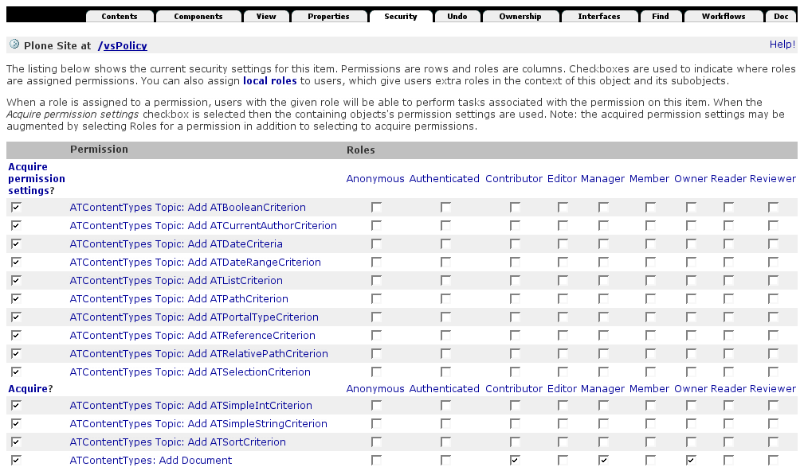
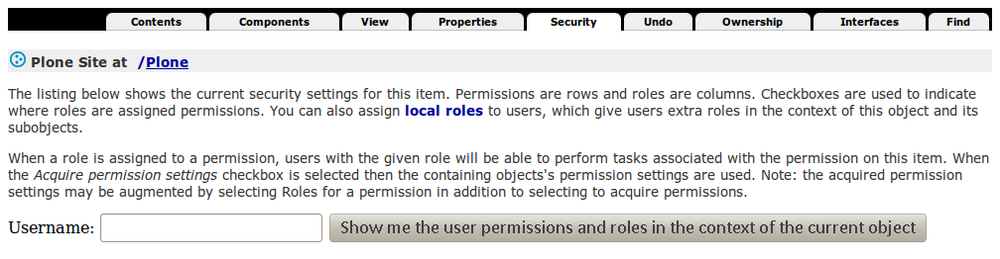

Berechtigungen
==============

In Plone kann für viele verschiedene Nutzungsfälle eine Zuordnung zu Rollen vorgenommen werden, die zur Ausführung berechtigt sind.

Sie können sich diese Zuordnungstabelle anschauen, indem Sie im ZMI auf den *Security*-Reiter klicken:

In der Tabelle können für ein bestimmtes Objekt die verschiedenen Berechtigungen den einzelnen Rollen zugewiesen werden. Beachten Sie bitte, dass für die meisten Berechtigungen *Acquire permission settings?* angeklickt ist und damit die Berechtigungen vom übergeordneten Objekt übernommen werden. Weitere Rollen können dann einfach durch Anklicken hinzugefügt werden.

Plone 4
-------

Plone 4 kommt mit Zope 2.12 und der damit gegebenen Möglichkeit, die Berechtigungen eines bestimmten Nutzers im Kontext anzuzeigen:

**Anmerkung 1:** Sie sollten niemals die Berechtigungen außerhalb des Wurzelverzeichnisses der Site ändern, da ansonsten kaum noch zu kontrollieren ist, welche Berechtigungen wo gesetzt sind.

**Anmerkung 2:** Im Quellcode sollte immer die Berechtigung (*permission*) und nie die Rolle (*role*) überprüft werden.

Die am häufigsten verwendeten Berechtigungen sind:

+-----------------------------------+--------------------------------------------+-----------------------------------+
| CMFCore Permission                | Five Permission                            | Beschreibung                      |
+===================================+============================================+===================================+
| ``AccessContentsInformation``     | ``zope2.AccessContentsInformation``        | Niedrigschwellige                 |
|                                   |                                            | Zope-Berechtigung, die den Zugang |
|                                   |                                            | zu Objekten kontrolliert          |
+-----------------------------------+--------------------------------------------+-----------------------------------+
| ``View``                          | ``zope2.View``                             | Zugang zu der Hauptansicht eines  |
|                                   |                                            | Inhaltsobjekts                    |
+-----------------------------------+--------------------------------------------+-----------------------------------+
| ``ListFolderContents``            | ``cmf.ListFolderContents``                 | Berechtigung, die                 |
|                                   |                                            | Verzeichnisübersicht zu sehen     |
+-----------------------------------+--------------------------------------------+-----------------------------------+
| ``ModifyPortalContent``           | ``cmf.ModifyPortalContent``                | Editiermöglichkeit für die        |
|                                   |                                            | Inhalte                           |
+-----------------------------------+--------------------------------------------+-----------------------------------+
| ``ManagePortal``                  | ``cmf.ManagePortal``                       | Operationen, die typischerweise   |
|                                   |                                            | der Manager-Rolle zugewiesen      |
|                                   |                                            | werden                            |
+-----------------------------------+--------------------------------------------+-----------------------------------+
| ``AddPortalContent``              | ``cmf.AddPortalContent``                   | Möglichkeit, neue Inhalte         |
|                                   |                                            | hinzuzufügen.                     |
|                                   |                                            | Darüberhinaus haben viele         |
|                                   |                                            | Artikeltypen ihre eigenen         |
|                                   |                                            | Berechtigungen zum Hinzufügen von |
|                                   |                                            | Inhalten, so dass beide           |
|                                   |                                            | Berechtigungen benötigt werden    |
+-----------------------------------+--------------------------------------------+-----------------------------------+

Eine vollständige Übersicht über alle ``CMFCore``-Berechtigungen erhalten Sie in ``Products.CMFCore.permissions`` und über alle ``Five``-Berechtigungen in ``Products.Five.permissions.zcml``.

Diese Berechtigungen können in ZCML-Anweisungen angegeben werden, z.B. in ``src/vs.registration/vs/registration/browser/configure.zcml``::

 <browser:page
     for="..interfaces.IRegistration"
     name="view"
     class=".registration.RegistrationView"
     permission="zope2.View"
     />

Erstellen von neuen Berechtigungen
----------------------------------

Obwohl die Standard-Berechtigungen verwendet werden sollten, um grundlegende
Aktionen (anzeigen, ändern, löschen, schreiben) zu steuern, ist es manchmal
sinnvoll, neue Berechtigungen erstellen. Kombiniert mit benutzerdefinierten
`Workflows <arbeitsablaeufe>`_ können benutzerdefinierte Berechtigungen
verwendet werden, um angepasste Anwendungen zu erstellen.

Die Berechtigungen können dann einfach in der ``configure.zcml``-Datei erstellt
werden::

    <permission
         id="vs.registration.AddRegistrant"
         title="vs.registration: Add registrant"
         />

     <permission
         id="vs.registration.ModifyRegistrant"
         title="vs.registration: Modify registrant"
         />

In Plone < 4.0 oder genauer in Zope < 2.12 muss zusätzlich
`collective.autopermission
<https://pypi.python.org/pypi/collective.autopermission>`_ installiert werden.
Hierfür wird in der ``setup.py``-Datei folgendes eingetragen::

    install_requires=[
        ...
        'collective.autopermission',
    ],

Neue Berechtigungen werden üblicherweise nur der Manager-Rolle übertragen. Um
anderen Rollen diese Berechtigungen ebenfalls zu übertragen, kann das Profil
``rolemap.xml`` erstellt werden::

    <?xml version="1.0"?>
    <rolemap>
      <permissions>
        <permission name="vs.registration: Add registrant" acquire="True">
          <role name="Owner"/>
          <role name="Manager"/>
          <role name="Member"/>
          <role name="Contributor"/>
        </permission>
        <permission name="vs.registration: Modify registrant" acquire="True">
          <role name="Manager"/>
          <role name="Reviewer"/>
        </permission>
      </permissions>
    </rolemap>
