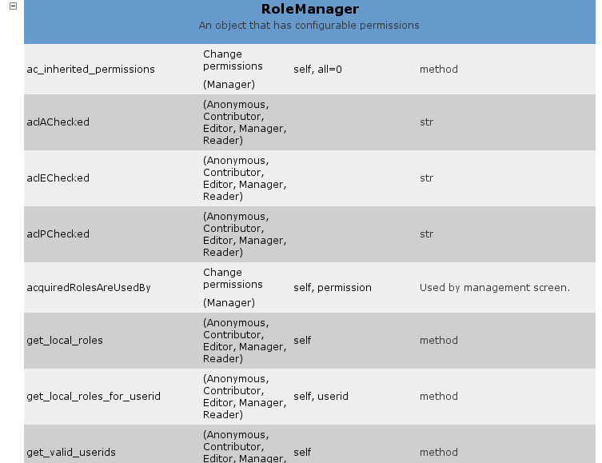

======
Rollen
======

Rollen können sowohl Nutzern als auch Gruppen zugewiesen werden. Dabei empfiehlt sich im Allgemeinen, Rollen zu erstellen, denen bestimmte Rechte zugewiesen werden, anstatt jedem Nutzer die jeweiligen Rechte zuzuweisen.

So haben z.B. die Gruppen *Reviewers* und *Administrators* die entsprechenden *Manager*- oder *Reviewer*-Rollen.

- Die **globale** Zuordnung von Nutzern und Gruppen zu einer Rolle können Sie in *Plone Konfiguration*  → *Benutzer und Gruppen* vornehmen.

- Die **lokale** Zuweisung von Rollen erfolgt im Allgemeinen im *Zugriff*-Reiter eines Inhaltsobjekts. Dort suchen Sie zunächst nach einem Nutzer oder einer Gruppe, um in den Suchergebnissen anschließend Zuweisungen zu bestimmten Rechten vornehmen zu können. Die lokal verfügbaren Rollen sind beschränkt auf die explizit angegebenen (s.a. ``plone/app/workflow/localroles.py`` und ``plone/app/workflow/configure.zcml``).

Plone selbst kommt mit sieben verschiedenen Rollen:

``Member``
 ist die Standardrolle für einen angemeldeten Nutzer, der nur wenige Rechte zugewiesen sind.
``Manager``
 ist die *super-user*-Rolle; sie ist der *Administrators*-Gruppe zugeordnet.
``Reviewer``
 erlaubt Inhabern der Rolle, Artikel zu sehen und zu bestätigen, deren Inhalte zur Veröffentlichung vorgeschlagen wurden.
``Reader``
 ist lediglich als lokale Rolle vorgesehen, wenn ``Member`` die Inhalte nicht sehen können.
``Editor``
 ist das Pendant zu ``Reader``, um Eigentümern die Möglichkeit zu geben, lokal Schreibrechte zu erteilen.
``Contributor``
 ermöglicht einem Eigentümer, das *Hinzufügen*-Recht in einem Ordner an andere zu übertragen. Es erscheint im *Zugriff*-Reiter unter *Kann hinzufügen*.
``Site Administrator``
 hat Management-Rechte bis auf

 - die Verwendung des *Wartung*-Kontrollfeldes
 - den Zugang zum Zope Management Interface (ZMI)
 - das Hinzufügen und Entfernen von Produkten
 - die Änderung des Aussehens
 - die Änderung der Cache-Konfiguration

Darüberhinaus definiert Zope noch drei automatisch zugewiesene Rollen:

``Owner``
 wird normalerweise dem Nutzer zugeordnet, der das Inhaltsobjekt erstellte.
``Authenticated``
 wird angemeldeten Nutzern zugewiesen. Diese Rolle ist niedrigschwelliger als ``Member`` und kann nicht explizit zugewiesen werden.
``Anonymous``
 ist die Rolle für nicht-angemeldete Nutzer.

Rechte und Rollen programmatisch ändern
=======================================

Die meisten niedrigschwelligen Sicherheitsmethoden werden in der  ``AccessControl.Role.RoleManager``-Klasse definiert. Diese ist in allen Inhaltsobjekten verfügbar einschließlich des *Plone Site*-Objekts selbst. Sie können sich diese Methoden im *Doc*-Reiter im Wurzelverzeichnis Ihrer Plone-Site anschauen:

|RoleManager|

Darüberhinaus empfiehlt sich auch ein Blick in den *Doc*-Reiter des *PlonePAS Membership Tool*.

Und hier noch einige der am häufigsten verwendeten programmatischen Änderungen von Rechten und Rollen:

Rechte überprüfen:
 ::

  from AccessControl import getSecurityManager
  from Products.CMFCore.permissions import ModifyPortalContent

  sm = getSecurityManager()
  if sm.checkPermission(ModifyPortalContent, context):
      # do something

Rechte ändern:
 ::

  context.manage_permission("Portlets: Manage portlets",
                            roles=['Manager', 'Owner'], acquire=1)

Überprüfen, ob ein Nutzer angemeldet ist oder nicht (d.i. *anonymous*):
 ::

  from Products.CMFCore.utils import getToolByName
  mtool = getToolByName(context, 'portal_membership')
  if mtool.isAnonymousUser():
      # do something

Herausfinden des aktuellen Nutzers:
 ::

  member = mtool.getAuthenticatedMember()
  user_id = member.getId()

Finden von Mitgliedern anhand der ID:
 ::

  admin_user = mtool.getMemberById('admin')

